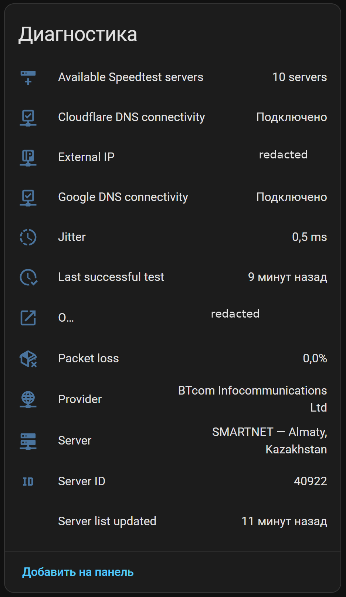

DigitalHouses Speedtest
Home Assistant App for internet availability monitoring and scheduled speed tests using the official Ookla Speedtest CLI.
Repository:
```text
https://github.com/DigitalHouses/home-assistant-apps
```
English
Features
Official Ookla Speedtest CLI
Download and upload speed
Ping and jitter
Packet loss when provided by the selected Ookla server
ISP and public IP
Selected server name and server ID
Ookla result URL
Manual speed-test button
Optional periodic tests every 5 to 720 minutes
Connectivity checks to `8.8.8.8` and `1.1.1.1`
Separate Home Assistant connectivity binary sensors
Automatic test suppression when both connectivity targets are unavailable
Preferred Ookla server IDs with optional automatic fallback
Nearby-server discovery with provider, location and server ID
Persistent state and server-list cache
Home Assistant MQTT Discovery
Automatic MQTT configuration through Home Assistant Supervisor
Requirements
Home Assistant OS or a supervised Home Assistant installation with Apps support
Mosquitto broker or another MQTT service exposed through Home Assistant Supervisor
`amd64` architecture
Installation
Open Settings → Apps → App store.
Open the menu in the upper-right corner.
Select Repositories.
Add:
```text
   https://github.com/DigitalHouses/home-assistant-apps
   ```
Close the repository dialog.
Find DigitalHouses Speedtest.
Install the App.
Review the configuration.
Start the App.
Enable Start on boot and Watchdog after confirming a successful first run.
Configuration
Example:
```yaml
periodic_test_enabled: true
periodic_test_interval_minutes: 180
server_ids: []
automatic_server_fallback: true
speedtest_timeout_seconds: 240
connectivity_check:
  interval_seconds: 60
  attempts: 3
  timeout_seconds: 2
expire_after_seconds: 14400
log_level: info
```
`periodic_test_enabled`
Enables or disables scheduled speed tests.
Manual tests and connectivity monitoring continue to work when scheduled tests are disabled.
`periodic_test_interval_minutes`
Scheduled test interval in minutes.
Allowed range:
```text
5–720
```
`server_ids`
Preferred Ookla server IDs in priority order.
Automatic server selection:
```yaml
server_ids: []
```
Preferred servers:
```yaml
server_ids:
  - 38516
  - 70668
```
Use the Refresh server list button in the MQTT device, then inspect the attributes of Available Speedtest servers to find nearby server IDs, providers and locations.
`automatic_server_fallback`
When enabled, the App uses automatic Ookla server selection after all configured server IDs fail.
`speedtest_timeout_seconds`
Maximum runtime for each Ookla Speedtest attempt.
`connectivity_check.interval_seconds`
Interval between connectivity checks.
`connectivity_check.attempts`
Number of ICMP echo requests sent to each connectivity target during one check.
`connectivity_check.timeout_seconds`
Timeout for each ICMP echo request.
`expire_after_seconds`
Time after which speed measurement entities become unavailable without a new successful test.
Set to `0` to disable expiry.
`log_level`
Available values:
```text
debug
info
warning
error
```
Home Assistant entities
The App creates one MQTT device named:
```text
Internet Speedtest
```
Main entities include:
Download
Upload
Ping
Jitter
Packet loss
Status
Last successful test
Provider
External IP
Server
Server ID
Ookla result URL
Google DNS connectivity
Cloudflare DNS connectivity
Available Speedtest servers
Server list updated
Run speed test
Refresh server list
What appears in Home Assistant
After the App connects to MQTT, Home Assistant creates one MQTT device named:
```text
Internet Speedtest
```
The device page is organized into three standard Home Assistant sections:
Sensors — download, upload, ping and current test status;
Controls — buttons for a manual speed test and refreshing the nearby-server list;
Diagnostics — internet connectivity, jitter, packet loss, provider, external IP, selected server, server ID, result URL and timestamps.


Entity values and section labels may be translated by Home Assistant according to the selected interface language.
Connectivity logic
The App checks:
```text
8.8.8.8
1.1.1.1
```
A speed test is allowed when at least one target is reachable.
When both targets are unavailable:
the speed test is skipped;
status changes to `No connectivity`;
previous speed results are preserved.
Recorder package
An optional Recorder package is included in the repository:
```text
examples/packages/internet_speedtest_package.yaml
```
Copy it to:
```text
/config/packages/internet_speedtest_package.yaml
```
Ensure `/config/configuration.yaml` contains:
```yaml
homeassistant:
  packages: !include_dir_named packages
```
Do not create a second `homeassistant:` section if one already exists.
The package explicitly records all Speedtest entities for history, diagnostics and later analysis.
Troubleshooting
The App cannot connect to MQTT
Confirm that the MQTT broker is installed, running and exposed as a Supervisor MQTT service.
Both connectivity sensors are off
Check internet access, routing, firewall rules and whether ICMP traffic to both public DNS addresses is blocked.
A configured server fails
Enable automatic fallback or refresh the nearby server list and replace the server ID.
Packet loss is `unknown`
Some Ookla servers or test sessions do not return packet-loss data. `unknown` means the metric was not provided; it does not mean `0%`.
License notice
DigitalHouses source code is licensed under the MIT License.
This App downloads and runs the official proprietary Ookla Speedtest CLI. Users are responsible for reviewing and complying with Ookla's license, terms of use and privacy policy.
---
Русский
Возможности
официальный Ookla Speedtest CLI;
скорость скачивания и отдачи;
ping и jitter;
packet loss, если выбранный сервер Ookla возвращает этот показатель;
провайдер и внешний IP;
название и ID использованного сервера;
URL результата Ookla;
кнопка ручного запуска;
периодические тесты с интервалом от 5 до 720 минут;
проверки доступности `8.8.8.8` и `1.1.1.1`;
отдельные binary sensor доступности в Home Assistant;
запрет запуска теста, когда недоступны оба контрольных адреса;
список предпочтительных серверов Ookla;
автоматический fallback;
получение списка ближайших серверов с провайдером, городом и ID;
постоянное хранение последнего состояния и списка серверов;
Home Assistant MQTT Discovery;
автоматическое получение параметров MQTT через Supervisor.
Требования
Home Assistant OS либо supervised-установка Home Assistant с поддержкой Apps;
Mosquitto broker либо другой MQTT-сервис, предоставленный через Home Assistant Supervisor;
архитектура `amd64`.
Установка
Откройте Настройки → Дополнения → Магазин дополнений.
Откройте меню в правом верхнем углу.
Выберите Репозитории.
Добавьте:
```text
   https://github.com/DigitalHouses/home-assistant-apps
   ```
Закройте окно репозиториев.
Найдите DigitalHouses Speedtest.
Установите приложение.
Проверьте конфигурацию.
Запустите приложение.
После успешного первого запуска включите Запуск при загрузке и Watchdog.
Конфигурация
Пример:
```yaml
periodic_test_enabled: true
periodic_test_interval_minutes: 180
server_ids: []
automatic_server_fallback: true
speedtest_timeout_seconds: 240
connectivity_check:
  interval_seconds: 60
  attempts: 3
  timeout_seconds: 2
expire_after_seconds: 14400
log_level: info
```
`periodic_test_enabled`
Включает или отключает периодические замеры скорости.
Ручной запуск и контроль доступности продолжают работать при отключённых периодических тестах.
`periodic_test_interval_minutes`
Интервал периодического теста в минутах.
Допустимый диапазон:
```text
5–720
```
`server_ids`
Предпочтительные ID серверов Ookla в порядке приоритета.
Автоматический выбор:
```yaml
server_ids: []
```
Предпочтительные серверы:
```yaml
server_ids:
  - 38516
  - 70668
```
Нажмите кнопку Refresh server list в MQTT-устройстве, затем откройте атрибуты сущности Available Speedtest servers. В них отображаются ID, провайдеры и расположение ближайших серверов.
`automatic_server_fallback`
При включённом параметре приложение переходит к автоматическому выбору Ookla после отказа всех указанных серверов.
`speedtest_timeout_seconds`
Максимальное время выполнения одной попытки Ookla Speedtest.
`connectivity_check.interval_seconds`
Интервал между проверками доступности.
`connectivity_check.attempts`
Количество ICMP-запросов к каждому контрольному адресу за одну проверку.
`connectivity_check.timeout_seconds`
Тайм-аут одного ICMP-запроса.
`expire_after_seconds`
Время, после которого сущности измерений становятся недоступными при отсутствии нового успешного теста.
Значение `0` отключает срок действия.
`log_level`
Допустимые значения:
```text
debug
info
warning
error
```
Сущности Home Assistant
Приложение создаёт одно MQTT-устройство:
```text
Internet Speedtest
```
Основные сущности:
Download
Upload
Ping
Jitter
Packet loss
Status
Last successful test
Provider
External IP
Server
Server ID
Ookla result URL
Google DNS connectivity
Cloudflare DNS connectivity
Available Speedtest servers
Server list updated
Run speed test
Refresh server list
Что появится в Home Assistant
После подключения приложения к MQTT Home Assistant создаёт одно MQTT-устройство:
```text
Internet Speedtest
```
На странице устройства сущности распределяются по трём стандартным разделам Home Assistant:
Сенсоры — download, upload, ping и текущий статус теста;
Настройки — кнопки ручного запуска теста и обновления списка ближайших серверов;
Диагностика — доступность интернета, jitter, packet loss, провайдер, внешний IP, выбранный сервер, ID сервера, URL результата и временные метки.


Названия системных разделов и значения некоторых состояний Home Assistant отображает на языке интерфейса пользователя.
Логика контроля доступности
Приложение проверяет:
```text
8.8.8.8
1.1.1.1
```
Тест скорости разрешён, если доступен хотя бы один адрес.
Если недоступны оба адреса:
тест скорости пропускается;
статус становится `No connectivity`;
предыдущие результаты сохраняются.
Пакет Recorder
В репозитории находится дополнительный пакет Recorder:
```text
examples/packages/internet_speedtest_package.yaml
```
Скопируйте его в:
```text
/config/packages/internet_speedtest_package.yaml
```
Убедитесь, что `/config/configuration.yaml` содержит:
```yaml
homeassistant:
  packages: !include_dir_named packages
```
Если раздел `homeassistant:` уже существует, второй раздел создавать нельзя.
Пакет явно включает все сущности Speedtest в Recorder для истории, диагностики и последующего анализа.
Диагностика
Приложение не подключается к MQTT
Убедитесь, что MQTT broker установлен, запущен и предоставлен как MQTT-сервис Supervisor.
Оба connectivity sensor выключены
Проверьте интернет, маршрутизацию, firewall и доступность ICMP к обоим публичным DNS-адресам.
Указанный сервер не работает
Включите automatic fallback либо обновите список ближайших серверов и замените ID.
Packet loss показывает `unknown`
Некоторые серверы Ookla или отдельные тестовые сессии не возвращают packet-loss. `unknown` означает отсутствие измерения, а не `0%`.
Лицензия
Исходный код DigitalHouses распространяется по лицензии MIT.
Приложение загружает и запускает официальный проприетарный Ookla Speedtest CLI. Пользователь самостоятельно отвечает за соблюдение лицензии, условий использования и политики конфиденциальности Ookla.
