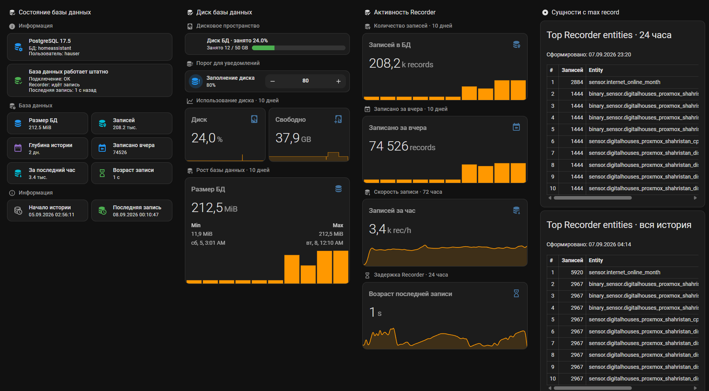

# DH Recorder Database Monitor

**DH Recorder Database Monitor** is a Home Assistant OS App for monitoring the main Home Assistant Recorder database parameters.

The App connects to the database used by Home Assistant Recorder, collects key database and Recorder metrics, and publishes them to Home Assistant through MQTT Discovery.

The main goal is to provide a simple and reusable way to monitor the health, size, history depth, and write activity of the Home Assistant database without creating multiple SQL sensors manually in `configuration.yaml`.



## Purpose

Home Assistant Recorder stores entity history and statistics in a database. On installations with long retention periods or a large number of entities, this database becomes an important part of the system.

DH Recorder Database Monitor provides visibility into the main Recorder database parameters directly from Home Assistant.

Typical use cases include:

* checking whether Recorder is actively writing data;
* monitoring database growth;
* checking the available history depth;
* monitoring the number of stored state records;
* detecting database connection problems;
* verifying the timestamp of the latest Recorder entry;
* monitoring Recorder activity over time.

## Supported Databases

The App is designed to support:

* PostgreSQL
* MariaDB

PostgreSQL connections are configured manually.

When MariaDB is installed as a Home Assistant OS App and exposes the Supervisor `mysql` service, DH Recorder Database Monitor can use that connection automatically.

## MQTT Integration

MQTT is obtained automatically through the Home Assistant Supervisor service discovery mechanism.

No MQTT host, username, or password needs to be entered manually when a compatible MQTT service is available in Home Assistant OS.

The App publishes one MQTT device containing all Recorder database monitoring entities.

## Home Assistant Entities

The initial version exposes the following entities:

| Entity ID                           | Description                                              |
| ----------------------------------- | -------------------------------------------------------- |
| `sensor.dh_db_start`                | Timestamp of the earliest state stored in the database   |
| `sensor.dh_db_last`                 | Timestamp of the latest state stored in the database     |
| `sensor.dh_db_depth`                | Recorder history depth in days                           |
| `sensor.dh_db_records_per_hour`     | Number of state records written during the last hour     |
| `sensor.dh_db_records`              | Total number of rows in the `states` table               |
| `sensor.dh_db_size`                 | Current database size                                    |
| `sensor.dh_db_version`              | Database server version                                  |
| `sensor.dh_db_yesterday_records`    | Number of state records written during the previous day  |
| `sensor.dh_db_name`                 | Current Recorder database name                           |
| `sensor.dh_db_user`                 | Database user used by the monitor                        |
| `binary_sensor.dh_db_connected`     | Database connection status                               |
| `binary_sensor.dh_db_recorder_writing` | Indicates whether Recorder is currently writing data     |
| `sensor.dh_db_last_age`             | Time elapsed since the latest Recorder state was written |

All entities are grouped under a single Home Assistant device:

**DH Recorder Database**

## How It Works

```text
Home Assistant Recorder
        │
        ▼
PostgreSQL / MariaDB
        │
        ▼
DH Recorder Database Monitor
        │
        ▼
MQTT Discovery
        │
        ▼
Home Assistant
```

The App periodically queries the Recorder database using different polling intervals.

Frequently changing health metrics are collected more often, while expensive database queries such as total row counts are executed less frequently.

This reduces unnecessary load on large Recorder databases.

## Polling Strategy

Default polling intervals:

| Metric group                      |               Interval |
| --------------------------------- | ---------------------: |
| Recorder health and latest state  |             60 seconds |
| Database size and hourly activity |              5 minutes |
| History depth and total records   |                 1 hour |
| Static database information       | On startup / reconnect |

Polling intervals can be adjusted in the App configuration.

## PostgreSQL Configuration

Example:

```yaml
database_type: postgresql

postgresql:
  host: 192.168.11.32
  port: 5432
  database: hassio
  username: hauser
  password: your_password
```

The PostgreSQL account only needs permission to read the required Recorder tables and database metadata.

## MariaDB Configuration

When the Home Assistant MariaDB App exposes the Supervisor MySQL service:

```yaml
database_type: mariadb

mariadb:
  connection: supervisor
```

A manual MariaDB connection can also be used:

```yaml
database_type: mariadb

mariadb:
  connection: manual
  host: 192.168.11.32
  port: 3306
  database: homeassistant
  username: hauser
  password: your_password
```

## Recorder Health Monitoring

One of the most useful entities is:

```text
binary_sensor.dh_db_recorder_writing
```

The App compares the latest Recorder state timestamp with the current time.

If no new state has been written within the configured threshold, the Recorder can be reported as not writing.

The default threshold is planned to be:

```text
300 seconds
```

This makes it possible to detect problems where Home Assistant is running normally but Recorder has stopped writing history to the database.

## Why Use This App

Without DH Recorder Database Monitor, similar monitoring usually requires multiple SQL sensors in Home Assistant configuration.

For example:

```yaml
sensor:
  - platform: sql
    queries:
      ...
```

This becomes difficult to maintain across multiple Home Assistant installations.

DH Recorder Database Monitor moves the database monitoring logic into a reusable Home Assistant OS App and automatically creates all required entities through MQTT Discovery.

This provides:

* one installation method;
* one configuration interface;
* consistent `dh_*` entity IDs;
* PostgreSQL and MariaDB support;
* no manual SQL sensors;
* no cron jobs;
* no overlapping shell scripts;
* centralized database monitoring logic.

## Security

The App does not modify the Home Assistant Recorder database.

It is intended to use read-only database access wherever possible.

The App does not require:

* privileged container access;
* Docker socket access;
* Home Assistant configuration directory access;
* access to `secrets.yaml`;
* Home Assistant API tokens.

Database credentials are stored in the Home Assistant App configuration and are never published to MQTT.

## Project Status

Current status:

**Initial development / V1**

The first release focuses on the main Home Assistant Recorder database metrics and reliable MQTT Discovery integration.

Additional PostgreSQL and MariaDB diagnostics may be added in future versions.

## Future Metrics

Possible future additions include:

* `states` table size;
* `statistics` table size;
* `statistics_short_term` table size;
* active database connections;
* maximum database connections;
* database uptime;
* cache hit ratio;
* deadlocks;
* transaction rollbacks;
* database growth per day;
* Recorder write rate trends.

## License

License information will be added before the first public release.
