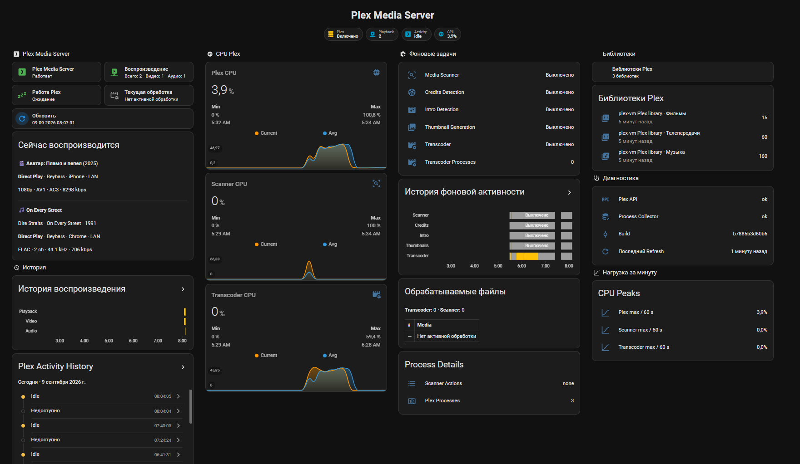

# DigitalHouses Plex Agent

[](https://github.com/DigitalHouses/home-assistant-apps/actions/workflows/validate.yml)
[](../LICENSE)


Native Linux agent for Plex Media Server workload, playback, transcoding and library observability in Home Assistant through MQTT Discovery.

[Install / update](#install--update) · [Changelog](CHANGELOG.md) · [Engineering docs](../docs/digitalhouses_plex_agent/) · [Issues](https://github.com/DigitalHouses/home-assistant-apps/issues)

The public product name, repository directory, release identifier and installed Linux runtime identity are **DigitalHouses Plex Agent** / `digitalhouses_plex_agent`. Version `0.6.0` migrates the previous `digitalhouses_plex_agent` service/filesystem identity to the canonical runtime while deliberately preserving the released MQTT/device/entity contract.

## Purpose

The agent answers two related questions:

> What was Plex doing when CPU temperature, VM/LXC CPU, GPU/video load, storage temperature, or thermal throttling changed?

> What content is Plex actually playing, on which client, and is it Direct Play, Direct Stream, or Transcode?

It runs beside Plex in the same VM, LXC, or Debian/Ubuntu Linux host. The Linux collector inspects local Plex processes; the local Plex API collector reads playback sessions and library counters. No Proxmox API or Plex account credentials are required.

## Dashboard



Lovelace example: [plex-dashboard.yaml](examples/lovelace/plex-dashboard.yaml)

## Install / update

Production install/update is pinned to the canonical release tag. Current release:

```text
digitalhouses_plex_agent-v0.6.0
```

From a root shell:

```bash
RELEASE_TAG="digitalhouses_plex_agent-v0.6.0"
curl -fsSL "https://raw.githubusercontent.com/DigitalHouses/home-assistant-apps/${RELEASE_TAG}/digitalhouses_plex_agent/install.sh" \
  | DIGITALHOUSES_SOURCE_REF="${RELEASE_TAG}" bash
```

From a sudo-capable user:

```bash
RELEASE_TAG="digitalhouses_plex_agent-v0.6.0"
curl -fsSL "https://raw.githubusercontent.com/DigitalHouses/home-assistant-apps/${RELEASE_TAG}/digitalhouses_plex_agent/install.sh" \
  | sudo env DIGITALHOUSES_SOURCE_REF="${RELEASE_TAG}" bash
```

Run the same release-tag command to reinstall that exact release. To update, change `RELEASE_TAG` to a newer published DigitalHouses Plex Agent release. Existing configuration is preserved.

The installer records the deployed product version, source tag/ref, and exact resolved commit SHA in:

```text
/opt/digitalhouses/digitalhouses_plex_agent/BUILD_INFO
```

Normal production installation rejects `main`, development branches, temporary refs, and arbitrary SHAs as the source ref. A non-release ref is available only through the explicit `DIGITALHOUSES_ALLOW_NON_RELEASE_REF=1` development/testing override.

Release provenance and publication follow the repository [Release Policy](../docs/standards/RELEASE_POLICY.md).

## Runtime migration from 0.5.x

Version `0.6.0` performs a controlled installed-runtime migration from the previous `digitalhouses_plex_monitoring` identity to `digitalhouses_plex_agent`.

On the first update from a legacy installation, the installer:

- stops and disables the legacy main/GPU-helper services;
- creates a root-only tar backup under `/var/backups/digitalhouses_plex_agent/`;
- copies the existing configuration, protected Plex token and persistent state into the canonical directories;
- rewrites only the old default Plex token path in the copied configuration;
- starts the canonical services and records an idempotent migration marker;
- automatically restores the previous legacy service state if the canonical main service fails to start.

The legacy `/etc/digitalhouses_plex_monitoring/` and `/var/lib/digitalhouses_plex_monitoring/` trees are retained after a successful first migration as an immediate rollback snapshot. They are not synchronized with later canonical runtime state.

This release does **not** rename the Home Assistant compatibility surface. The following remain unchanged:

```text
MQTT base:  DigitalHouses/Global/plex_monitoring
device ID:  digitalhouses_plex_monitoring_plex
entities:   sensor.dh_plex_*
            binary_sensor.dh_plex_*
            button.dh_plex_*
```

Those identities require a separate Home Assistant migration and are not part of the Linux runtime cutover.

## Local Plex API authentication

On a standard Linux Plex installation the installer detects:

```text
/var/lib/plexmediaserver/Library/Application Support/Plex Media Server/.LocalAdminToken
```

The installer copies the token to a protected service-readable file:

```text
/etc/digitalhouses_plex_agent/plex_local_admin_token
```

The copy is owned by `root:digitalhouses_plex_agent` with mode `0640` and is refreshed on install/update when Plex provides `.LocalAdminToken`. The original Plex token permissions are not changed. The token is not stored in MQTT state, logs, or the repository.

The API collector connects by default only to:

```text
http://127.0.0.1:32400
```

Existing 0.1.x configuration files continue to work: the `[plex_api]` section has defaults and does not have to be added manually.

## Configuration

```text
/etc/digitalhouses_plex_agent/digitalhouses_plex_agent.conf
```

Default telemetry and Plex API settings:

```ini
[general]
instance_id = plex
instance_name = DH Plex
poll_interval_seconds = 10
cpu_window_seconds = 60
log_level = info

[telemetry]
cpu_change_threshold = 5
high_load_threshold = 80
high_load_publish_interval_seconds = 60

[plex_api]
enabled = true
base_url = http://127.0.0.1:32400
token_file = /etc/digitalhouses_plex_agent/plex_local_admin_token
timeout_seconds = 3
library_refresh_seconds = 3600
```

CPU sensors use a machine-wide **0-100%** scale. The agent sums Plex process CPU time and divides it by the number of logical CPUs available to the Plex host/VM. On a 4-vCPU VM, one fully occupied logical CPU therefore appears as 25%. The configured `high_load_threshold = 80` means 80% of the whole machine CPU capacity.

## Playback contract

Every playback session contains a normalized top-level content type:

```text
content_type: video | audio
```

This is intentionally separate from Plex media types such as `movie`, `episode`, and `track`. Home Assistant automations can use the dedicated binary sensors without parsing session attributes:

```text
binary_sensor.dh_plex_video_playback_active
binary_sensor.dh_plex_audio_playback_active
```

`sensor.dh_plex_playback_sessions` exposes session attributes such as title, year, artist/album for music, series/season/episode for TV, user, player, platform, state, LAN/remote location, bandwidth, playback mode, codec decisions, and hardware-transcode details when Plex supplies them.

Playback mode is normalized as `Direct Play`, `Direct Stream`, `Transcode`, or `Unknown`.

## Libraries

The API collector reads `/library/sections` and publishes both an aggregate library sensor and stable per-library entities based on the Plex section ID.

Example:

```text
sensor.dh_plex_libraries
sensor.dh_plex_library_1
sensor.dh_plex_library_2
sensor.dh_plex_library_3
```

The state of a per-library sensor is the count of playable leaf content:

- movie library: movies;
- TV library: episodes, with show and season counts in attributes;
- music library: tracks, with artist and album counts in attributes.

Library attributes also contain `content_type: video|audio`, Plex library type, title, section ID, and path. Counters refresh after the first successful API collection, on manual Refresh, after Plex Scanner finishes, and periodically according to `library_refresh_seconds`.

## Main entities

With default `instance_id = plex`:

```text
sensor.dh_plex_activity
sensor.dh_plex_current_item

binary_sensor.dh_plex_server_running
binary_sensor.dh_plex_scanner_running
binary_sensor.dh_plex_credits_detection
binary_sensor.dh_plex_intro_detection
binary_sensor.dh_plex_thumbnail_generation
binary_sensor.dh_plex_transcoder_running

sensor.dh_plex_playback_count
sensor.dh_plex_playback_sessions
binary_sensor.dh_plex_playback_active
binary_sensor.dh_plex_video_playback_active
binary_sensor.dh_plex_audio_playback_active
sensor.dh_plex_playback_started_at
sensor.dh_plex_libraries
sensor.dh_plex_library_<section_id>

sensor.dh_plex_cpu
sensor.dh_plex_scanner_cpu
sensor.dh_plex_transcoder_cpu

sensor.dh_plex_gpu_video
sensor.dh_plex_gpu_render
sensor.dh_plex_gpu_video_enhance
sensor.dh_plex_gpu_frequency
sensor.dh_plex_gpu_temperature
sensor.dh_plex_gpu_rc6
sensor.dh_plex_gpu_status
binary_sensor.dh_plex_hardware_transcode_active

sensor.dh_plex_transcoder_count
sensor.dh_plex_scanner_actions
sensor.dh_plex_process_count
sensor.dh_plex_collector_status
sensor.dh_plex_api_status
sensor.dh_plex_agent_version
sensor.dh_plex_agent_uptime
sensor.dh_plex_agent_started_at
sensor.dh_plex_last_boot
sensor.dh_plex_publication_profile
sensor.dh_plex_last_publication
sensor.dh_plex_last_refresh
button.dh_plex_refresh
```

`sensor.dh_plex_current_item` remains a Linux **workload** sensor. It describes media files currently being processed by Plex processes; it is not a list of user playback sessions.

## Standalone Intel GPU telemetry

Plex Agent collects Intel GPU engine telemetry locally on the same Linux host/VM as Plex. It does not require DH PVE or the Proxmox API. On supported Intel DRM/i915 systems it exposes Video, Render/3D, Video Enhance, actual GPU frequency and RC6 residency from `intel_gpu_top`.

GPU temperature is published only when Linux exposes a real hwmon sensor attached to the GPU. CPU/SoC temperature is never relabeled as GPU temperature. On systems such as the current Alder Lake-N Plex VM, GPU load can be available while GPU temperature remains unavailable.

`binary_sensor.dh_plex_hardware_transcode_active` comes from Plex playback-session semantics; the GPU sensors independently show measured hardware activity.

`sensor.dh_plex_last_boot` is the Linux host/VM boot timestamp and therefore survives Plex Agent restarts. `sensor.dh_plex_agent_started_at` is the current agent process start timestamp; `sensor.dh_plex_agent_uptime` remains a separate low-level duration diagnostic for compatibility.

`sensor.dh_plex_playback_started_at` is the earliest first-observed start timestamp among the currently active Plex playback sessions. Internal session identities remain private to the agent and are persisted only under `/var/lib/digitalhouses_plex_agent/` so an agent restart does not reset an ongoing session timestamp. When no playback is active, no playback-start timestamp is reported.

On Linux hosts where i915 PMU access requires elevated privilege, only the dedicated `digitalhouses_plex_agent_gpu_helper.service` receives `CAP_SYS_ADMIN`. The main `digitalhouses_plex_agent.service` remains unprivileged. The helper has no MQTT or Plex API responsibility; it writes a timestamped local state file that the main agent reads and rejects when stale.

## Publication policy

Plex uses the same Linux Agent runtime model as DH PVE: **collection cadence and Recorder publication cadence are independent**.

The process namespace and playback endpoint are sampled every 10 seconds by default. Sampling remains fixed when the publication profile changes.

MQTT state is split into retained semantic groups:

- `activity` — Plex Server / Scanner / Transcoder state and current workload;
- `cpu` — total, scanner and transcoder CPU on a machine-wide 0-100% scale;
- `playback` — playback sessions, playback start timestamp, video/audio activity and hardware-transcode state;
- `libraries` — library inventory and counters;
- `gpu` — local Intel GPU engine/frequency/temperature telemetry when available;
- `diagnostics` — collector/API state, agent version, agent start/uptime, server boot timestamp, publication profile and last publication.

Continuous CPU and GPU samples use adaptive Recorder-facing presentation windows without changing the fixed acquisition cadence:

- `NORMAL` — one averaged publication per 15 minutes while idle;
- `DETAIL` — one averaged publication per 5 minutes for Scanner activity or sustained high CPU without playback;
- `PLAYBACK` — one averaged publication per 30 seconds while Plex playback is active or Plex Transcoder is running.

Entering or leaving `PLAYBACK` publishes CPU and GPU immediately. Activity, playback and library semantic changes also publish immediately and do not wait for an averaging window.

Manual Refresh publishes a current snapshot of all groups. MQTT/Home Assistant reconnect republishes the retained group cache without forcing a new collection. Failed group publications are retried independently.

The diagnostics group publishes a lightweight uptime heartbeat once per minute when no other publication refreshes diagnostics. Playback bandwidth alone does not trigger a playback publication. Playback position is deliberately not published, avoiding high-frequency Recorder writes.

## Collector independence

The two collectors fail independently:

```text
/proc                         -> workload / CPU / scanner / transcoder
127.0.0.1:32400/status/sessions -> playback sessions
127.0.0.1:32400/library/...      -> libraries and counters
```

A Plex API failure does not stop Linux workload monitoring. A process-visibility failure does not prevent successful API playback/library updates.

The Home Assistant Plex integration is not required for playback count or library counters since version 0.2.0.

## Activity classification

Known scanner signatures include:

- Credits: `--server-action credits`, `--creditsTempDataPath`, Credits log suffix;
- Intro: `--server-action intro` or `intros`;
- thumbnails/indexing: `--server-action index`, `--index`, `-b`, `--chapter-thumbs-only`.

Unknown Plex Media Scanner work remains visible as generic `scanner` activity and its `--server-action` values remain visible in `sensor.dh_plex_scanner_actions`.

`Plex Transcoder` means a transcoder process exists. It does **not** by itself prove that a user playback session is being transcoded. Playback mode comes from the Plex session API.

## Operations

```bash
systemctl status digitalhouses_plex_agent
journalctl -u digitalhouses_plex_agent -f
```

## Filesystem

```text
/opt/digitalhouses/digitalhouses_plex_agent/
/etc/digitalhouses_plex_agent/digitalhouses_plex_agent.conf
/etc/digitalhouses_plex_agent/plex_local_admin_token
/var/lib/digitalhouses_plex_agent/
journald
```


## Support and license

Report reproducible bugs or feature requests through the repository [Issues](https://github.com/DigitalHouses/home-assistant-apps/issues). Security-sensitive reports follow the repository [security policy](../.github/SECURITY.md).

DigitalHouses Plex Agent is provided under the repository [MIT License](../LICENSE).
