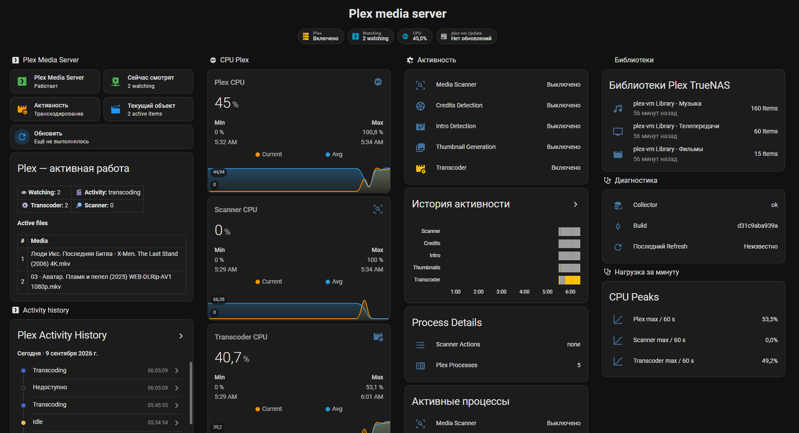

# DigitalHouses Plex Monitoring

Native Linux workload, playback, and library monitoring for Plex Media Server with Home Assistant MQTT Device Discovery.

## Purpose

The agent answers two related questions:

> What was Plex doing when CPU temperature, VM/LXC CPU, GPU/video load, storage temperature, or thermal throttling changed?

> What content is Plex actually playing, on which client, and is it Direct Play, Direct Stream, or Transcode?

It runs beside Plex in the same VM, LXC, or Debian/Ubuntu Linux host. The Linux collector inspects local Plex processes; the local Plex API collector reads playback sessions and library counters. No Proxmox API or Plex account credentials are required.

## Dashboard



Lovelace example: [plex-dashboard.yaml](examples/lovelace/plex-dashboard.yaml)

## Install / update

From a root shell:

```bash
curl -fsSL https://raw.githubusercontent.com/DigitalHouses/home-assistant-apps/main/digitalhouses_plex_monitoring/install.sh | bash
```

From a sudo-capable user:

```bash
curl -fsSL https://raw.githubusercontent.com/DigitalHouses/home-assistant-apps/main/digitalhouses_plex_monitoring/install.sh | sudo bash
```

Run the same command again to update from `main`. Existing configuration is preserved.

## Local Plex API authentication

On a standard Linux Plex installation the installer detects:

```text
/var/lib/plexmediaserver/Library/Application Support/Plex Media Server/.LocalAdminToken
```

The installer copies the token to a protected service-readable file:

```text
/etc/digitalhouses_plex_monitoring/plex_local_admin_token
```

The copy is owned by `root:digitalhouses_plex_monitoring` with mode `0640` and is refreshed on install/update when Plex provides `.LocalAdminToken`. The original Plex token permissions are not changed. The token is not stored in MQTT state, logs, or the repository.

The API collector connects by default only to:

```text
http://127.0.0.1:32400
```

Existing 0.1.x configuration files continue to work: the `[plex_api]` section has defaults and does not have to be added manually.

## Configuration

```text
/etc/digitalhouses_plex_monitoring/digitalhouses_plex_monitoring.conf
```

Default telemetry and Plex API settings:

```ini
[general]
instance_id = plex
instance_name = DH Plex
poll_interval_seconds = 10
cpu_window_seconds = 60
log_level = info

[telemetry]
cpu_change_threshold = 5
high_load_threshold = 80
high_load_publish_interval_seconds = 60

[plex_api]
enabled = true
base_url = http://127.0.0.1:32400
token_file = /etc/digitalhouses_plex_monitoring/plex_local_admin_token
timeout_seconds = 3
library_refresh_seconds = 3600
```

CPU follows Linux `top` semantics: **100% means one logical CPU**. Values above 100% are valid on a multi-vCPU Plex guest.

## Playback contract

Every playback session contains a normalized top-level content type:

```text
content_type: video | audio
```

This is intentionally separate from Plex media types such as `movie`, `episode`, and `track`. Home Assistant automations can use the dedicated binary sensors without parsing session attributes:

```text
binary_sensor.dh_plex_video_playback_active
binary_sensor.dh_plex_audio_playback_active
```

`sensor.dh_plex_playback_sessions` exposes session attributes such as title, year, artist/album for music, series/season/episode for TV, user, player, platform, state, LAN/remote location, bandwidth, playback mode, codec decisions, and hardware-transcode details when Plex supplies them.

Playback mode is normalized as `Direct Play`, `Direct Stream`, `Transcode`, or `Unknown`.

## Libraries

The API collector reads `/library/sections` and publishes both an aggregate library sensor and stable per-library entities based on the Plex section ID.

Example:

```text
sensor.dh_plex_libraries
sensor.dh_plex_library_1
sensor.dh_plex_library_2
sensor.dh_plex_library_3
```

The state of a per-library sensor is the count of playable leaf content:

- movie library: movies;
- TV library: episodes, with show and season counts in attributes;
- music library: tracks, with artist and album counts in attributes.

Library attributes also contain `content_type: video|audio`, Plex library type, title, section ID, and path. Counters refresh after the first successful API collection, on manual Refresh, after Plex Scanner finishes, and periodically according to `library_refresh_seconds`.

## Main entities

With default `instance_id = plex`:

```text
sensor.dh_plex_activity
sensor.dh_plex_current_item

binary_sensor.dh_plex_server_running
binary_sensor.dh_plex_scanner_running
binary_sensor.dh_plex_credits_detection
binary_sensor.dh_plex_intro_detection
binary_sensor.dh_plex_thumbnail_generation
binary_sensor.dh_plex_transcoder_running

sensor.dh_plex_playback_count
sensor.dh_plex_playback_sessions
binary_sensor.dh_plex_playback_active
binary_sensor.dh_plex_video_playback_active
binary_sensor.dh_plex_audio_playback_active
sensor.dh_plex_libraries
sensor.dh_plex_library_<section_id>

sensor.dh_plex_cpu
sensor.dh_plex_cpu_avg
sensor.dh_plex_cpu_max
sensor.dh_plex_scanner_cpu
sensor.dh_plex_scanner_cpu_avg
sensor.dh_plex_scanner_cpu_max
sensor.dh_plex_transcoder_cpu
sensor.dh_plex_transcoder_cpu_avg
sensor.dh_plex_transcoder_cpu_max

sensor.dh_plex_transcoder_count
sensor.dh_plex_scanner_actions
sensor.dh_plex_process_count
sensor.dh_plex_collector_status
sensor.dh_plex_api_status
sensor.dh_plex_build
sensor.dh_plex_last_refresh
button.dh_plex_refresh
```

`sensor.dh_plex_current_item` remains a Linux **workload** sensor. It describes media files currently being processed by Plex processes; it is not a list of user playback sessions.

## Publication policy

The process namespace and playback endpoint are sampled on the normal poll interval, default 10 seconds. MQTT is not published on every sample.

A full state is published:

- at startup/reconnect/Home Assistant birth;
- on manual Refresh;
- when Plex workload activity changes;
- when playback sessions change semantically, including start/stop, title, client, state, or playback mode;
- when current total/scanner/transcoder CPU crosses the existing publication thresholds;
- when Plex API or process collector availability changes;
- when library counters change.

Playback bandwidth alone does not trigger publication. Playback position is deliberately not published, avoiding high-frequency Recorder writes.

## Collector independence

The two collectors fail independently:

```text
/proc                         -> workload / CPU / scanner / transcoder
127.0.0.1:32400/status/sessions -> playback sessions
127.0.0.1:32400/library/...      -> libraries and counters
```

A Plex API failure does not stop Linux workload monitoring. A process-visibility failure does not prevent successful API playback/library updates.

The Home Assistant Plex integration is not required for playback count or library counters since version 0.2.0.

## Activity classification

Known scanner signatures include:

- Credits: `--server-action credits`, `--creditsTempDataPath`, Credits log suffix;
- Intro: `--server-action intro` or `intros`;
- thumbnails/indexing: `--server-action index`, `--index`, `-b`, `--chapter-thumbs-only`.

Unknown Plex Media Scanner work remains visible as generic `scanner` activity and its `--server-action` values remain visible in `sensor.dh_plex_scanner_actions`.

`Plex Transcoder` means a transcoder process exists. It does **not** by itself prove that a user playback session is being transcoded. Playback mode comes from the Plex session API.

## Operations

```bash
systemctl status digitalhouses_plex_monitoring
journalctl -u digitalhouses_plex_monitoring -f
```

## Filesystem

```text
/opt/digitalhouses/digitalhouses_plex_monitoring/
/etc/digitalhouses_plex_monitoring/digitalhouses_plex_monitoring.conf
/etc/digitalhouses_plex_monitoring/plex_local_admin_token
/var/lib/digitalhouses_plex_monitoring/
journald
```
