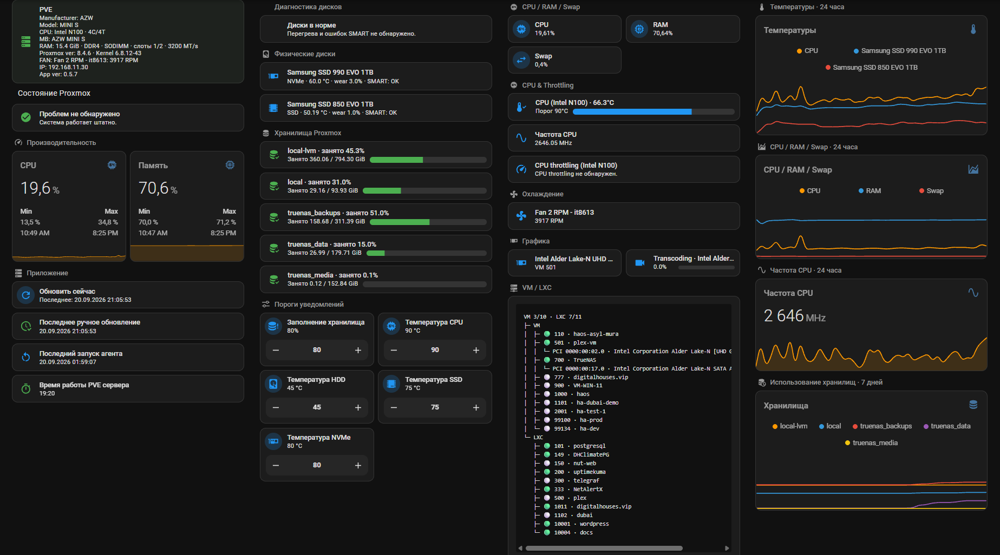

# DigitalHouses PVE Agent

[](https://github.com/DigitalHouses/home-assistant-apps/actions/workflows/validate.yml)
[](../LICENSE)


Native Linux agent for **Proxmox VE 8.x** that publishes host, CPU, memory, storage, disk/SMART, GPU, fan, VM/LXC and optional NUT/UPS observability to Home Assistant through MQTT Discovery.

[Installation / update](#installation--update) · [Changelog](CHANGELOG.md) · [Engineering docs](../docs/digitalhouses_pve_agent/) · [Issues](https://github.com/DigitalHouses/home-assistant-apps/issues)

The canonical product and runtime identity is **DigitalHouses PVE Agent** / `digitalhouses_pve_agent`: systemd service `digitalhouses_pve_agent.service`, filesystem roots under `/opt/digitalhouses/digitalhouses_pve_agent`, `/etc/digitalhouses_pve_agent` and `/var/lib/digitalhouses_pve_agent`, MQTT base `DigitalHouses/Global/digitalhouses_pve_agent/<instance>`, and Home Assistant entity prefix `dh_pve_agent_*`. Version 0.5.30 performs the corrected one-time controlled migration from the former `dh_pve_app` / `dh_app_pve_*` runtime, including deterministic cleanup of retained data owned by the legacy MQTT instance namespace.

Current source release: `VERSION` is `0.5.30`.

## Home Assistant dashboard



Example of the DigitalHouses PVE Agent dashboard in Home Assistant.

## Architecture

The App is the source of truth for acquisition, calculations, thresholds, problem state, topology, UPS interpretation and effective policy. Home Assistant is a light client for UI, explicit Recorder history, notifications and user configuration input.

Normal data-source priority on Proxmox VE 8.x is:

1. `/proc` and `/sys`;
2. `/etc/pve` configuration and PVE-maintained cache/status files;
3. a subprocess only when there is no suitable cheap source;
4. `pvesh`/API actions only for rare or on-demand work.

A failed cheap parser/source is reported as unavailable/problem state. The daemon does not fall back permanently to heavy `pvesh`, `qm`, `pct`, `pvesm` or QGA polling loops.

## Fixed collection cadence

Collection cadence is App-owned and does not accelerate because a resource becomes busy:

- `FAST` — 10 s: CPU, temperature/frequency, RAM, Swap, fans;
- `UPS` — 10 s: NUT runtime data;
- `SLOW` — 60 s: storage usage, disk temperature, GPU/transcoding, VM/LXC runtime, host runtime diagnostics and `/etc/pve/.version` check;
- `HEALTH` — 1 h: full SMART/wear and genuinely heavy health diagnostics;
- `STATIC` — startup and detected PVE configuration-version changes. Manual Refresh rebuilds topology and refreshes UI-facing host/guest/CPU/memory/storage/fan data immediately, while full SMART/health, GPU/transcoding and disk-temperature collectors remain on their scheduled cadences.

The legacy `[ups] poll_interval_seconds` configuration key is accepted only for upgrade compatibility and is ignored; UPS collection remains fixed at 10 seconds.

Manual Refresh executes the relevant current-state collection immediately. Heavy HEALTH operations remain sequential rather than creating a parallel burst.

## Fan monitoring and calibration

Fan RPM acquisition reads Linux hwmon directly from `/sys/class/hwmon/hwmon*/fan*_input`; it does not add a `sensors`/vendor subprocess to the FAST loop.

Every exported tachometer input starts as a candidate channel. A physical fan is confirmed after two consecutive valid `RPM > 0` FAST observations. Confirmed IDs are persisted separately so a real fan remains exposed after an App restart even when it is currently stopped at `0 RPM`. Unconfirmed zero-RPM channels remain internal candidates and do not create Home Assistant RPM entities.

Stable fan identity uses the hwmon chip, resolved underlying device and fan channel rather than the volatile `hwmonN` directory number. The diagnostic fan summary reports confirmed `count` plus `candidate_count`, `confirmed_count` and `unconfirmed_count`.

Unconfirmed fan candidates are omitted from normal MQTT Discovery. They are never tombstoned merely because they are still in debounce or currently report `0 RPM`: neither condition proves that a physical fan is absent. Explicit Device Discovery tombstones remain reserved for authoritative migrations/removals that are independent of live fan-presence inference.

`pwm*` and `/sys/class/thermal/cooling_device*` are not used as proof of a physical fan or as RPM sources. The installed `/root/digitalhouses_pve_agent.txt` guide contains generic read-only fan troubleshooting. Beelink/AZW driver installation, verification and rollback are documented separately in `hardware/beelink/README.md`.

For an explicitly supported write-capable hardware profile, the App can calibrate each confirmed physical fan against its measured maximum RPM. Calibration state is persisted separately from fan-presence state. The user-facing sensor is `Fan speed % = current RPM / calibrated max RPM × 100`, rounded to the nearest integer and clamped to 0..100%; the raw RPM sensor remains diagnostic.

Calibration is a guarded transaction: capture the original PWM/control state, persist a pending restore record, drive only the matched supported channel to maximum, detect a stable RPM plateau, and restore/verify the original control state in all normal failure paths. An interrupted transaction is recovered on the next App start. A restore failure becomes a serious App-owned problem rather than being hidden.

The first write-capable profile is the tested Beelink/AZW IT8613 `it87.2608 fan2 ↔ pwm2` path. The measured ~5400 RPM value from the test machine is a reference only and is never hardcoded as a production maximum. Unsupported fans remain read-only: RPM stays available, Fan Speed % is unavailable, and no calibration button is exposed.

A calibrated maximum may increase automatically if ordinary operation produces three stable RPM samples more than the tolerance above the stored ceiling. A single spike never changes calibration, and the automatic learning path never decreases `max_rpm`. Manual recalibration uses the same backend use-case as first-run calibration.

### Beelink / AZW IT8613E host profile

For Beelink/AZW mini PCs that require the newer upstream `it87` driver to expose IT8613E fan RPM, use the repository-owned host profile in `hardware/beelink/`.

The profile is intentionally separate from the generic App installer. It installs the pinned driver through the native Proxmox/Debian path — APT headers and DKMS, `depmod`, `modules-load.d` and `modprobe` — without replacing the stock Proxmox kernel module. It is idempotent, has a read-only `--check` mode, verifies `fan2_input` and the real `digitalhouses_pve_agent` collector, and includes a symmetric uninstall path.

See `hardware/beelink/README.md` for the standalone install/repair command, read-only `--check`, reboot handling and rollback. For production, the profile is taken from the same canonical release tag as the installed Agent. Development/recovery use of another ref must be explicit.

## MQTT presentation

Collection and Home Assistant publication are separate concerns. Continuous telemetry is published through independent retained groups rather than one monolithic state object.

The normal publication windows are:

- `NORMAL` — 15 min;
- `DETAIL` — 5 min.

`DETAIL` is selected per domain and only changes MQTT presentation frequency. It never increases collector frequency, SMART frequency, NUT polling cost or command/API depth. Meaningful discrete changes publish immediately. Retained PVE problem state also updates immediately; only user-facing PVE problem/recovery machine events are delayed by the configured debounce.

Canonical Home Assistant entity prefixes are:

- PVE: `dh_pve_agent_*`;
- UPS: `dh_pve_agent_ups_*`.

Legacy MQTT Discovery identities are removed through retained tombstones during migration so old and canonical entities do not coexist indefinitely.

## Problems and diagnostics

Problem calculation is App-owned. Home Assistant does not scan `states.sensor`, wildcard all entities, rebuild topology or calculate thresholds.

Current problems are exposed as `binary_sensor` entities with `device_class: problem`. Aggregate problem state and compact presentation are separate retained sensors.

The installed App release is exposed as diagnostic entity `sensor.dh_pve_agent_app_version`. Its state comes from the same `VERSION` value used by MQTT Device Discovery `device.sw_version` and `origin.sw_version`. The standard PVE dashboard shows it in the host summary as `App <version>` and hides that segment if the entity is unavailable or unknown.

The current agent process start is exposed as `sensor.dh_pve_agent_agent_started` with Home Assistant `device_class: timestamp`. Its value is fixed for the lifetime of the running agent process and changes only after an agent restart, allowing Home Assistant to present the age natively instead of publishing a continuously changing uptime duration.

Native MQTT Event entities are used for diagnostic transitions:

- `event.dh_pve_agent_diagnostic`;
- `event.dh_pve_agent_ups_diagnostic`.

PVE problem events are semantic: CPU temperature high/normal, CPU throttling started/cleared, storage usage high/normal, disk/GPU temperature high/normal, fan-control restore failed/restored and disk SMART failed/restored. Changes while a problem remains active are reflected immediately in retained problem/telemetry state; no generic transient `problem_updated` Event is published. UPS Event Discovery uses explicit user-semantic events: NUT unavailable/restored, power-state unknown/restored, line-power lost/restored, enter/clear events for low/high battery, replace-battery, bypass, calibration, output-off, overload, AVR Trim/Boost, Forced Shutdown and alarm, plus `battery_discharge_level_crossed`, `battery_fully_charged`, `shutdown_committed` and `config_changed`.

New public App events use `schema_version: 2` and contain machine semantics only: IDs/enums, previous/current state, numeric values, thresholds, timestamps and reason codes. Events also carry an event-time assessment snapshot when relevant. For example, an UPS line-power event carries charge/runtime/load/voltage facts captured with that event, while a PVE temperature or storage event carries the current value plus threshold and useful capacity/CPU context. Home Assistant therefore does not reread mutable telemetry sensors to explain an old event. App event payloads do not generate notification `title`, `message`, `summary`, `details`, localized labels, emoji or `status_ru`. Runtime Event messages are non-retained, published with MQTT QoS 1 after the synchronized retained current-state bundle, and Home Assistant subscribes to the Event topics at QoS 1 through MQTT Discovery.

The retained problem binaries and aggregate sensors are the authoritative current-state/reconciliation contract. Event entities describe what just happened; they are not used as retained state. Retryable UPS semantic events use a small persisted outbox so an MQTT publish failure does not silently advance semantic state past an undelivered Event.

PVE start/recovery events are debounced independently from retained state:

```ini
[events]
pve_problem_debounce_seconds = 30
```

The default is 30 seconds; valid values are 0..3600 seconds and 0 disables debounce. The problem binary/aggregate changes as soon as the App confirms the collector state. A user-facing start or recovery Event is published only if that state remains unchanged for the full debounce interval. If it flips back during the interval, the pending Event is cancelled.

## Optional UPS UI contract

UPS monitoring is optional. The always-present PVE device exposes `binary_sensor.dh_pve_agent_ups_configured` from the persistent UPS selection state:

- `off` — no UPS has been provisioned for this PVE host; the UPS dashboard should show one neutral “UPS not configured” card and hide the UPS-specific view;
- `on` + `binary_sensor.dh_pve_agent_ups_available = off` — a UPS is provisioned but NUT cannot currently read it; this is a real availability problem and must remain visible;
- `on` + UPS available — show the full UPS dashboard.

UPS controls that depend on hardware capabilities have stable diagnostic facts: `binary_sensor.dh_pve_agent_ups_quick_test_supported`, `binary_sensor.dh_pve_agent_ups_deep_test_supported`, `binary_sensor.dh_pve_agent_ups_stop_test_supported`, and `binary_sensor.dh_pve_agent_ups_beeper_control_supported`. UI cards may use these facts for visibility instead of referencing an entity that the UPS does not support.

## UPS status, charger and battery semantics

Canonical UPS status is derived from NUT tokens into stable machine states such as `online`, `on_battery`, `boost`, `trim`, `bypass`, `overload`, `low_battery` and `replace_battery`. Raw NUT status tokens remain available diagnostically.

Canonical charger state is exposed as `sensor.dh_pve_agent_ups_battery_charger_status` with machine values `charging`, `discharging`, `floating`, `resting`, `idle` or `unknown`. `battery.charger.status` has priority. `CHRG`/`DISCHRG` are charger fallback evidence only when a direct charger status is not available; a present but unknown direct value is not overridden by token fallback.

Battery discharge notification milestones are fixed machine events at 90, 80, 70, 60, 50, 40, 30, 20 and 10 percent. They are independent from the configurable shutdown charge threshold. A large downward jump may report multiple crossed milestones in one Event, and persisted discharge-session state prevents duplicate milestones after restart.

`battery_fully_charged` means an observed charge-cycle completion. It does not require `battery.charge == 100`. Direct `floating`/`resting` charger states complete an observed charging cycle immediately; legacy token-only devices use the guarded fallback implemented by the App.

`shutdown_committed` is emitted only when the App's software shutdown helper has actually committed the configured shutdown path. Native NUT FSD remains a separate fact and does not by itself imply an App `shutdown_committed` Event.

## Home Assistant notification layer

App events contain machine facts only. The Home Assistant notification layer is intentionally simple:

```text
machine event
→ trigger.id
→ choose
→ direct action
```

The PVE HA examples are:

- `examples/packages/dh_pve_agent_package.yaml` — non-language helpers, Recorder and Logbook;
- `examples/packages/dh_pve_agent_notification_local_package.yaml` — English local notification example;
- `examples/packages/locales/ru/dh_pve_agent_notification_local_package.yaml` — Russian site-local notification package.

Install the base package and one local notification package. The local package gives every user-visible situation its own `event.received` trigger and matching `trigger.id`, routes it through `choose`, and calls the delivery service directly. For example, `line_power_lost` is the exact place to edit the text shown when the UPS switches to battery, `line_power_restored` is the restore event, `boost_started` is the exact place for AVR Boost, and `cpu_throttling_started` or `storage_usage_high` are the exact places for those PVE alerts. The bundled text demonstrates the event-time context fields, such as UPS charge/runtime/load/input voltage or PVE temperature/frequency/threshold/free space.

Both public notification examples use `persistent_notification.create`. A user may replace that direct action with any local `notify.*`, script or other Home Assistant service.

Event data is read directly from `trigger.to_state.attributes`. The notification automation does not create another Home Assistant notification event and does not repeat the producer's machine-event schema validation.

Live events are transient. If Home Assistant is offline when an event occurs, that old event is not replayed as a new notification. Current state remains available through the product sensors and binary sensors.

When upgrading from 0.5.16 or earlier, remove the old `dh_pve_agent_notification_package.yaml` and any temporary delivery/adapter package before installing `dh_pve_agent_notification_local_package.yaml`. The standalone `dh_pve_agent_ui_package.yaml` remains obsolete because its helpers are already consolidated into `dh_pve_agent_package.yaml`.

## Product telemetry

DigitalHouses product telemetry is explicit opt-in and defaults to OFF:

```ini
[telemetry]
enabled = false
```

When enabled, only a canonical released build may send protocol-v1 heartbeat data to `telemetry.digitalhouses.vip`. The payload contains exactly: protocol schema version, telemetry policy version, a random per-product installation UUID, canonical product identifier and product version. The per-installation token is sent only as the HTTP Bearer credential. Hostname, machine ID, customer/site identity, IP address as payload data, hardware inventory, Home Assistant UUID, commit SHA, release tag and uptime are not transmitted.

Telemetry identity and scheduling state are persisted in `/var/lib/digitalhouses/digitalhouses_pve_agent/telemetry.json`. Telemetry HTTP runs in an isolated worker so DNS/TLS/server failure cannot block PVE, UPS or MQTT monitoring. Branch, `main` and arbitrary-SHA builds are not allowed to send production telemetry even if the config flag is enabled.

The shared privacy/consent contract is documented in [DigitalHouses Product Telemetry Policy](../docs/standards/PRODUCT_TELEMETRY_POLICY.md). The current installation can request authenticated deletion with:

```bash
PYTHONPATH=/opt/digitalhouses/digitalhouses_pve_agent \
/opt/digitalhouses/digitalhouses_pve_agent/.venv/bin/python -m app.main \
  --config /etc/digitalhouses_pve_agent/digitalhouses_pve_agent.conf \
  --state-dir /var/lib/digitalhouses_pve_agent \
  --telemetry-delete
```

## Recorder

Recorder configuration is an explicit whitelist. Continuous history is kept only for useful metrics such as CPU, RAM/Swap, fan speed %, storage usage, disk temperature/wear, GPU telemetry and selected UPS telemetry/status.

Rich presentation, debug diagnostics, the static `sensor.dh_pve_agent_app_version` and `sensor.dh_pve_agent_agent_started` metadata entities, and MQTT Event entities are intentionally not Recorder history.

## UPS / NUT ownership

Physical ownership is:

```text
UPS -> USB -> Proxmox -> NUT
```

Proxmox/NUT remains the shutdown authority. Home Assistant never decides to shut down Proxmox and does not expose generic shell, arbitrary `upscmd`, `load.*`, UPS output-off or arbitrary FSD controls.

The long-running `digitalhouses_pve_agent.service` treats `/etc/nut` as read-only. Existing administrator NUT/upssched configuration may be observed for diagnostics, but the former App-managed ONBATT/upssched timer writer and root commissioning CLI are not part of the current product path.

Native UPS/NUT Low Battery behavior remains authoritative. The App does not install `ignorelb` and does not rewrite/synthesize hardware Low Battery thresholds.

## UPS Trigger Policy v2

Software shutdown uses two independent guards joined by OR, plus native NUT Low Battery:

```text
Trigger A: OB and battery.charge <= configured charge threshold
OR
Trigger B: OB and battery.runtime <= shutdown_budget + runtime reserve
OR
native NUT Low Battery emergency path
```

Editable policy values are:

- battery charge shutdown threshold: 10..30 %, step 5;
- runtime reserve: 60..900 s, step 60.

The current default runtime reserve is 180 seconds.

`shutdown_budget` is calculated by the App from current PVE shutdown configuration plus comparable clean shutdown history. The active guest budget uses only VM/LXC that are currently running. The App also calculates an all-configured-guest diagnostic budget, including stopped non-template guests, without inflating the active UPS budget. The regular Trigger B path uses cheap PVE files/cache; it does not run `qm list`/`pct list` every UPS poll. Budget/configuration fingerprints prevent unrelated historical shutdown samples from being treated as comparable.

PVE shutdown history stores the plan that belonged to each boot/shutdown cycle instead of reconstructing it later from current settings. Records expose App-calculated planned/actual shutdown times, the running guest set, shutdown sequence and `shutdown_status` (`correct`, `incorrect` or `unknown`). Per-guest `last_shutdown_*` facts are tracked independently, so a standalone `qm shutdown`/`pct shutdown` can update that guest's factual duration without creating a PVE shutdown-history record. The separate `next_shutdown_*` fields project that measured duration onto the guest's current PVE timeout and are used by shutdown readiness; historical facts are not rewritten when configuration changes. VM/LXC status entities also expose `onboot` for compact autostart presentation.

Storage backed by a VM/NAS through NFS/CIFS/SMB can extend the final host shutdown if the provider disappears before unmount. That dependency is treated as an explicit shutdown-budget risk and is not hidden by guest-duration history.

## HA policy workflow

The UPS trigger controls are MQTT Discovery configuration entities:

- `number.dh_pve_agent_ups_shutdown_battery_charge_threshold`;
- `number.dh_pve_agent_ups_shutdown_runtime_reserve`;
- `button.dh_pve_agent_ups_apply_trigger_policy`.

Changing a number changes only the draft. It does **not** change the active shutdown policy.

The consolidated base package `examples/packages/dh_pve_agent_package.yaml` and `examples/dh_pve_agent_ups_dashboard.yaml` implement a VIEW -> EDIT -> CONFIRM -> APPLY workflow. `sensor.dh_pve_agent_ups_trigger_policy` is the read-only committed-policy presentation entity; draft `number` entities are never shown as if they were active values. Opening the editor snapshots committed values, Cancel restores the draft, and only a complete validated schema-v2 `config_changed` Event closes the editor back to VIEW. UI state is validated as numeric before conversion; missing/invalid state or a draft acknowledgement timeout stops the script explicitly instead of coercing the value to zero or implying success.

A real Apply is a durable transaction:

1. validate draft;
2. persist a pending target while keeping the previous active policy;
3. request the fixed `digitalhouses_pve_agent.service` reload;
4. handle `SIGHUP` in the main loop;
5. promote and reread/verify the target policy;
6. publish synchronized current state;
7. publish `config_changed` OLD -> NEW last.

A no-op Apply does not reload the service, increment the policy revision or emit an event. Reload/request/verification failure rolls back to the previous active policy. An interrupted transaction is also recovered conservatively on startup.

The service reload command is fixed internally. MQTT cannot provide a service name or shell command.

## Fixed FSD boundary

When Trigger A or Trigger B commits, the App can only call the installed immutable helper:

```text
/opt/digitalhouses/digitalhouses_pve_agent/bin/digitalhouses-pve-agent-ups-policy-cmd dh-pve-ups-shutdown
```

The helper has one fixed action: NUT FSD through `/sbin/upsmon -c fsd`. There is no generic helper argument surface.

A software-trigger shutdown reason is recorded only after the fixed helper returns successfully. Failed helper execution is not latched as a successful shutdown commitment and may be retried on a later valid UPS sample.

## UPS battery tests and beeper

Supported controls are capability-driven:

- Refresh;
- Quick battery test;
- Deep battery test;
- Stop test;
- physical beeper switch when the UPS exposes paired beeper commands.

Quick and Deep schedules are independent. A scheduled test can temporarily set its configured beeper mode; the original physical beeper state is restored after completion, failure or stop. Manual tests use the current beeper state and do not apply a temporary override.

## Read-only preflight

A non-destructive UPS/NUT/PVE safety report is available without MQTT:

```bash
python -m app.main \
  --config /etc/digitalhouses_pve_agent/digitalhouses_pve_agent.conf \
  --state-dir /var/lib/digitalhouses_pve_agent \
  --ups-policy-preflight
```

Preflight checks the selected UPS, NUT services/PRIMARY path, native Low Battery safety, fixed helper ownership/mode and relevant shutdown facts. It does not trigger FSD or modify `/etc/nut`.

## Installation / update

Production install/update is release-tag only. Version 0.5.30 is the corrected controlled runtime-identity migration release: an existing `dh_pve_app.service` installation is stopped, its config/state are copied to canonical paths, retained messages owned by the exact legacy `<topic_prefix>/<instance>/#` namespace plus known legacy Discovery topics are tombstoned, the old default MQTT base is rewritten to the canonical base, the new service is validated and started, and only then are the legacy service/paths removed. Non-retained traffic, foreign instances and the canonical MQTT namespace are not targeted. If MQTT cleanup fails, canonical startup is aborted and the previous legacy service is restored; if canonical startup itself fails, the installer also restores the previous legacy service.

```bash
TAG=digitalhouses_pve_agent-v0.5.30
DIGITALHOUSES_SOURCE_REF="$TAG" \
  bash <(curl -fsSL "https://raw.githubusercontent.com/DigitalHouses/home-assistant-apps/$TAG/digitalhouses_pve_agent/install.sh")
```

The installer verifies that the tag is canonical and that `digitalhouses_pve_agent-v<version>` exactly matches the source `VERSION`. `BUILD_INFO` stores both the canonical release tag and the resolved full commit SHA.

Branch or arbitrary-SHA deployment is not a production path. It is available only through an explicit development/recovery override:

```bash
REF=<branch-or-full-sha>
DIGITALHOUSES_INSTALL_MODE=development \
DIGITALHOUSES_SOURCE_REF="$REF" \
  bash <(curl -fsSL "https://raw.githubusercontent.com/DigitalHouses/home-assistant-apps/$REF/digitalhouses_pve_agent/install.sh")
```

On first install, the installer validates the MQTT port, collects host/port/username/password interactively, shows a password-safe summary and writes the configuration only after explicit `y/yes` confirmation.

After deployment verify the installed version/tag/SHA, `digitalhouses_pve_agent.service`, MQTT availability, canonical Home Assistant entities and UPS preflight before any UPS shutdown commissioning.

## Installed operational guide

After a successful install/update, the installer writes a short operational
reference to:

```text
/root/digitalhouses_pve_agent.txt
```

The canonical guide is stored in the repository as
`digitalhouses_pve_agent/dh_pve_agent.txt`. The installed copy is regenerated on every
successful update and is prefixed with the actual installed `version`,
`source` and `commit`.

The guide contains the normal install/update commands, service/log/config
commands, read-only UPS preflight, important paths and supported uninstall
commands. Supported uninstall removes the root guide after successful MQTT
cleanup so a stale reference is not left behind.

## Supported uninstall

The installer deploys an executable supported uninstaller at:

```bash
/opt/digitalhouses/digitalhouses_pve_agent/uninstall.sh
```

A normal uninstall records the service state and stops the service gracefully, then runs MQTT cleanup while the installed Python environment and source are still present. Only after cleanup succeeds does it disable/remove the unit and App runtime. The cleanup publishes canonical PVE and UPS availability as retained `offline`, then removes canonical and legacy PVE/UPS MQTT Discovery through retained tombstones. It preserves:

- `/etc/digitalhouses_pve_agent/`;
- `/var/lib/digitalhouses_pve_agent/`.

This keeps configuration, identity and persistent state available for a later reinstall.

Full removal is explicit:

```bash
/opt/digitalhouses/digitalhouses_pve_agent/uninstall.sh --purge
```

`uninstall.sh --purge` performs the same MQTT cleanup first, then additionally deletes `/etc/digitalhouses_pve_agent/` and `/var/lib/digitalhouses_pve_agent/`.

If MQTT cleanup fails, uninstall aborts with a non-zero status and does not remove the unit, App files, configuration or state. If `digitalhouses_pve_agent.service` was active before uninstall, it is started again.

Uninstall does not modify NUT configuration/services, does not issue FSD or UPS output/load commands, does not remove shared OS dependencies, and does not modify Home Assistant or the MQTT broker.

## Safety boundary

Routine CI/deploy validation is non-destructive. It must not casually perform:

- live FSD;
- UPS output/load off;
- mains unplug tests;
- deep-discharge testing;
- Home Assistant initiated host shutdown.

Live shutdown commissioning is a separate reviewed gate after code, configuration, runtime budget and topology are validated.


## Support and license

Report reproducible bugs or feature requests through the repository [Issues](https://github.com/DigitalHouses/home-assistant-apps/issues). Security-sensitive reports follow the repository [security policy](../.github/SECURITY.md).

DigitalHouses PVE Agent is provided under the repository [MIT License](../LICENSE).
