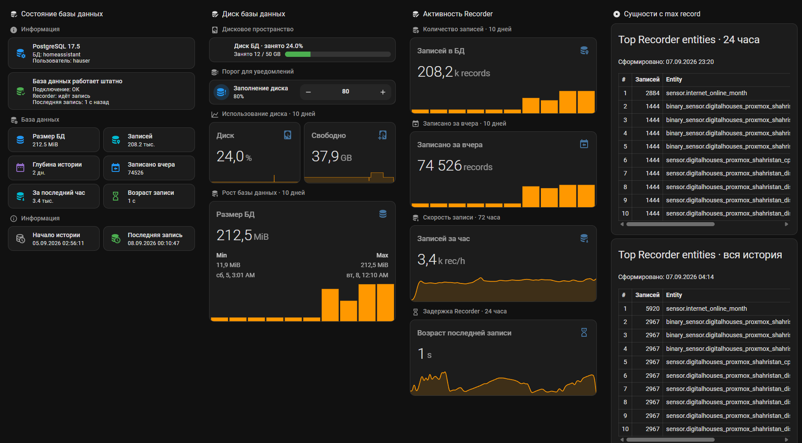

# DigitalHouses Recorder App

[](https://github.com/DigitalHouses/home-assistant-apps/actions/workflows/validate.yml)
[](../LICENSE)


Home Assistant App for monitoring the health, retained history, write activity, size and storage footprint of the database used by Home Assistant Recorder.

[Quick start](#quick-start) · [Technical documentation](DOCS.md) · [HA/MQTT migration](#hamqtt-identity-migration) · [Changelog](CHANGELOG.md) · [Issues](https://github.com/DigitalHouses/home-assistant-apps/issues)

Canonical product and Home Assistant App identity:

```text
digitalhouses_recorder_app
```

Canonical MQTT/HA identity completed by the 0.1.16 cleanup release:

```text
MQTT base:    DigitalHouses/Global/digitalhouses_recorder_app
device ID:    digitalhouses_recorder_app
entity prefix dh_recorder_app
```



## Quick start

1. In Home Assistant open **Settings → Apps → App store → Repositories**.
2. Add:

```text
https://github.com/DigitalHouses/home-assistant-apps
```

3. Install **DigitalHouses Recorder App**.
4. Select PostgreSQL or MariaDB, configure the database connection, and optionally enable storage monitoring.
5. Start the App. MQTT credentials are obtained from the Home Assistant Supervisor MQTT service.

The production App uses the versioned GHCR image family:

```text
ghcr.io/digitalhouses/digitalhouses_recorder_app
```

## What it monitors

Recorder App publishes one canonical MQTT Discovery device with:

- database connectivity and Recorder write activity;
- earliest/latest retained state and history depth;
- rolling-hour, current-hour, current-day, previous-day and total Recorder state-row volume in thousands;
- database size, type, database name/user and server version;
- optional filesystem free, used, total and used percentage;
- configurable Top-N Recorder entities for the last 24 hours and all retained history;
- on-demand full refresh and last successful refresh timestamp;
- App-owned disk-usage threshold;
- machine events for DB/Recorder/storage transitions;
- common runtime diagnostics: App Version and Started at.

## Supported databases

- **PostgreSQL** — manual database connection.
- **MariaDB Supervisor App** — automatic Supervisor MySQL service connection.
- **External MariaDB** — manual database connection.

The App reads Recorder data and database metadata; it does not modify Recorder tables.

## Canonical Home Assistant entities

Core diagnostics and controls include:

| Entity ID | Purpose |
| --- | --- |
| `sensor.dh_recorder_app_version` | Running Recorder App release |
| `sensor.dh_recorder_app_started_at` | Current App process start timestamp |
| `sensor.dh_recorder_app_database_type` | PostgreSQL or MariaDB |
| `sensor.dh_recorder_app_db_start` | Earliest retained Recorder state |
| `sensor.dh_recorder_app_db_last` | Latest Recorder state |
| `sensor.dh_recorder_app_db_depth` | Retained history depth |
| `sensor.dh_recorder_app_db_records_per_hour` | Recorder writes during the rolling last 60 minutes, K rec/h |
| `sensor.dh_recorder_app_db_previous_hour_records` | Recorder writes during the previous completed local hour, K records |
| `sensor.dh_recorder_app_db_current_hour_records` | Recorder writes since the start of the current local hour, K records |
| `sensor.dh_recorder_app_db_today_records` | Recorder writes since local midnight, K records |
| `sensor.dh_recorder_app_db_records` | Total Recorder state rows, K records |
| `sensor.dh_recorder_app_db_size` | Database size |
| `sensor.dh_recorder_app_db_version` | Database server/version |
| `sensor.dh_recorder_app_db_yesterday_records` | Previous local-day Recorder writes, K records |
| `sensor.dh_recorder_app_db_name` | Database name reported by the server |
| `sensor.dh_recorder_app_db_user` | Database user reported by the server |
| `binary_sensor.dh_recorder_app_db_connected` | Database connectivity after the first real observation |
| `binary_sensor.dh_recorder_app_recorder_writing` | Recorder write activity |
| `sensor.dh_recorder_app_db_last_age` | Age of the latest Recorder state |
| `sensor.dh_recorder_app_db_top_entities_24h` | Top Recorder entities for 24h |
| `sensor.dh_recorder_app_db_top_entities_all_time` | Top Recorder entities across retained history |
| `button.dh_recorder_app_db_refresh` | Full on-demand refresh |
| `sensor.dh_recorder_app_db_last_refresh` | Last successful full manual refresh |
| `number.dh_recorder_app_db_disk_usage_threshold` | App-owned storage threshold |
| `event.dh_recorder_app_diagnostic` | Machine transition events |
| `button.dh_recorder_app_delete_telemetry` | Authenticated deletion of this installation's telemetry record |

When storage monitoring is enabled:

- `sensor.dh_recorder_app_db_disk_free`
- `sensor.dh_recorder_app_db_disk_used`
- `sensor.dh_recorder_app_db_disk_total`
- `sensor.dh_recorder_app_db_disk_used_percentage`

## HA/MQTT identity migration

Release 0.1.15 provided the controlled compatibility bridge from the released
legacy contract to the canonical Recorder App identity. Live acceptance
confirmed the canonical device/entities, local package migration, telemetry,
and App-data backup/restore before cleanup.

Release 0.1.16 completes that migration. Runtime publication and command/event
handling are canonical-only:

```text
MQTT base:    DigitalHouses/Global/digitalhouses_recorder_app
device ID:    digitalhouses_recorder_app
entity prefix dh_recorder_app
```

On the first 0.1.16 MQTT connection, the App removes retained state under the
former `DigitalHouses/Global/db_monitoring` namespace and publishes an empty
retained Discovery payload for `digitalhouses_db_monitoring`. Each retained
delete uses QoS 1 and must be acknowledged by the broker before cleanup is
marked complete.

Migration state is persisted in:

```text
/data/ha_mqtt_identity_migration.json
```

After the marker reaches `phase=completed`, rolling back to bridge release
0.1.15 does not resurrect the legacy identity. Releases 0.1.14 and older
predate this completed-marker behavior and are not safe rollback targets after
cleanup.

Historical Supervisor slug migration is separate and remains complete. The
Supervisor slug is:

```text
digitalhouses_recorder_app
```

## Machine events and notifications

Recorder App publishes transient MQTT Events through:

```text
event.dh_recorder_app_diagnostic
```

Event types:

- `db_connection_lost`
- `db_connection_restored`
- `recorder_writing_stopped`
- `recorder_writing_restored`
- `storage_usage_high`
- `storage_usage_normal`

Events use QoS 1 and `retain=false`. State is published before the transition event. The App establishes a startup baseline without synthetic alert/recovery events.

Local Home Assistant notification logic should remain:

```text
machine event
→ trigger.id
→ choose
→ direct action
```

The public product has no dependency on `notify.*`, Telegram, site-specific helpers or any private delivery service.

## Contract Data behavior

Required product facts are validated before publication.

- Version is a strict semantic release value and is shared by the Version sensor, `device.sw_version` and `origin.sw_version`.
- Started at is created once per App process and is timezone-aware ISO8601.
- Database type is required configuration-derived state.
- Database name, database user and database version are considered available only after all required static database fields were read successfully.
- DB connectivity remains unavailable until the first actual connection observation.
- Recorder-writing state is not synthesized as `false` when DB state is unknown.
- Event payloads are validated by event-specific required-field contracts.

Optional metrics may remain absent/null where their schema allows it, for example when Recorder contains no state rows yet.

## Telemetry

Согласие на сбор статистики DigitalHouses обязательно для запуска Recorder App. В настройках Home Assistant App расположен переключатель `telemetry_enabled` с начальным значением `false` и текстом:

> Consent to collect statistics (product name, version, installation ID).

При `false` (в том числе после обновления ранее установленной версии) App выводит в журнал `Statistics collection consent not granted. Stopping application.` и останавливается **до подключения к БД, MQTT и инициализации телеметрии**. Для работы необходимо вручную выбрать `true`; обновление не изменяет это значение автоматически. Если согласие отозвано, последующий запуск также завершается.

Формат и периодичность протокола v1 не меняются. Отправляются только:

- schema;
- telemetry policy version;
- persistent installation UUID;
- product `digitalhouses_recorder_app`;
- running release version.

It does not send database host/name/user, Home Assistant identity, hostname, IP, storage path, SSH information, metrics or country.

Installation identity and a 256-bit token are stored in:

```text
/data/telemetry.json
```

После согласия первый heartbeat и отчёт о новой версии выполняются по существующему графику, далее приблизительно каждые 24 часа. Ошибки DNS/HTTPS или недоступность сервера статистики не останавливают мониторинг Recorder; повторная попытка — через час. Существующая кнопка удаления записи телеметрии сохранена.

## Polling strategy

Recorder health uses `publish_interval_minutes`, default one minute. Expensive work is rate-limited:

| Metric group | Interval |
| --- | ---: |
| Recorder health/latest state | Configured publish interval |
| Database size/current record counters | 5 minutes |
| Storage metrics | 5 minutes |
| History depth/total records | 1 hour |
| Top entities — 24h | 1 hour |
| Top entities — all retained history | 1 day |
| Static database information | Startup/reconnect until successful |

A manual refresh collects every enabled group immediately without changing the normal background intervals.

For historical bar charts, use the closed-period measurements:
`db_previous_hour_records` for hourly bars and `db_yesterday_records` for
daily bars. `db_current_hour_records` and `db_today_records` remain live
period-to-date diagnostics.

Top-entity ranking rows include the absolute record count and the entity's percentage
share of all Recorder rows in the same ranking window. The 24-hour ranking uses a
rolling `now - 24h .. now` epoch window; the all-history ranking uses all retained
Recorder rows.

## Configuration examples

PostgreSQL:

```yaml
database_type: postgresql
postgresql:
  host: "db.example.local"
  port: 5432
  database: homeassistant
  username: recorder_monitor
  password: "CHANGE_ME"
top_entities_limit: 10
telemetry_enabled: false
```

Supervisor MariaDB:

```yaml
database_type: mariadb
mariadb:
  connection: supervisor
top_entities_limit: 10
telemetry_enabled: false
```

External MariaDB:

```yaml
database_type: mariadb
mariadb:
  connection: manual
  host: "db.example.local"
  port: 3306
  database: homeassistant
  username: recorder_monitor
  password: "CHANGE_ME"
telemetry_enabled: false
```

## Storage monitoring

Storage collection can be automatic, explicit SSH, or disabled.

For Supervisor MariaDB, automatic mode uses Home Assistant OS host storage information. For external PostgreSQL/MariaDB, storage can be collected through a normal SSH user that can log in and run `df`; root access is not required.

See [Technical documentation](DOCS.md) for path autodetection and PostgreSQL cluster selection.

## Backup and restore

Product-persistent state lives under `/data`, including telemetry identity, runtime threshold, SSH known-host state where applicable and HA/MQTT migration state. It is App data, not a container image copy.

Production image delivery is external through versioned GHCR releases. Release automation records the immutable image digest and source merge commit, so a historical App release can resolve its historical registry image rather than embedding a duplicate image in App backup data.

HA/MQTT cleanup was enabled only after live partial App backup/restore acceptance confirmed persistent telemetry identity under `/data`.

## Security

The App does not require privileged container access, Docker socket access, Home Assistant configuration-directory access, `secrets.yaml` or a Home Assistant API token.

Database credentials remain in Home Assistant App configuration and are never published to MQTT or telemetry. Use least-privileged database and SSH accounts that satisfy the documented read-only requirements.

## Support and license

Report reproducible bugs or feature requests through repository [Issues](https://github.com/DigitalHouses/home-assistant-apps/issues). Security-sensitive reports follow the repository [security policy](../.github/SECURITY.md).

DigitalHouses Recorder App is provided under the repository [MIT License](../LICENSE).
