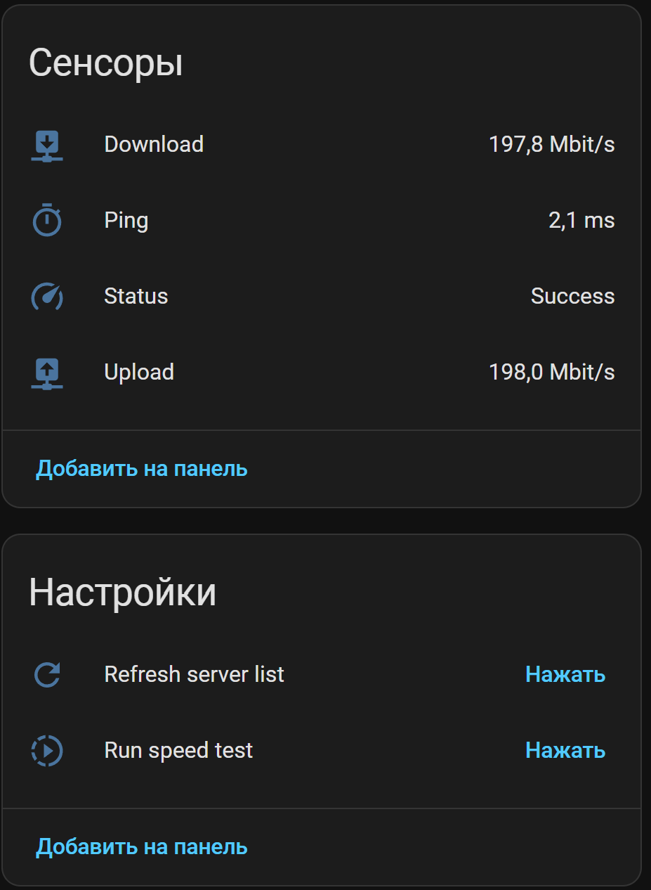
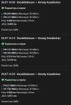

# DigitalHouses Speedtest

Home Assistant App for internet availability monitoring and scheduled speed
tests using the official Ookla Speedtest CLI.

## English

### Features

- Download and upload speed
- Ping and jitter
- Packet loss when returned by Ookla
- ISP, public IP, selected server, server ID and result URL
- Manual speed-test button
- Periodic tests every 5–720 minutes; default **30 minutes**
- Live periodic-interval Number with immediate rescheduling
- Independent connectivity checks to `8.8.8.8` and `1.1.1.1`
- Preferred Ookla server IDs with automatic fallback
- Nearby-server discovery
- MQTT numbers for performance thresholds
- Problem binary sensors with immediate recalculation
- Persistent Recent results for successful tests
- Home Assistant MQTT Device Discovery
- Persistent state in `/data`

### Requirements

- Home Assistant OS or supervised Home Assistant with Apps support
- MQTT broker exposed through Home Assistant Supervisor
- `amd64` architecture

### Installation

1. Open **Settings → Apps → App store**.
2. Open the menu and select **Repositories**.
3. Add `https://github.com/DigitalHouses/home-assistant-apps`.
4. Install **DigitalHouses Speedtest**.
5. Review the configuration and start the App.
6. Enable Start on boot and Watchdog after the first successful run.

### Configuration example

```yaml
periodic_test_enabled: true
periodic_test_interval_minutes: 30
server_ids: []
automatic_server_fallback: true
speedtest_timeout_seconds: 240
connectivity_check:
  interval_seconds: 60
  attempts: 3
  timeout_seconds: 2
expire_after_seconds: 14400
recent_results_limit: 20
log_level: info
```

`recent_results_limit` accepts values from 5 to 50. Only successful tests are
stored.

### Periodic test interval

Version 1.1.1 adds:

- `number.internet_speed_periodic_interval`

The Number accepts 5–720 minutes with a 5-minute UI step. Changing it in Home
Assistant immediately restarts the countdown to the next automatic test; the
App does not need to restart.

The existing `periodic_test_interval_minutes` App option remains supported for
backward compatibility. On the first 1.1.1 start it initializes the Number.
Later Number changes persist in `/data/schedule.json`. If the App option is
explicitly changed and the App is restarted, that new App-option value is
adopted and published back to the Number.

`periodic_test_enabled` remains the master enable/disable option. The Number
can be changed while periodic tests are disabled, but no automatic tests run
until the App option is enabled.

### Performance thresholds

Version 1.1.0 adds three MQTT Number entities:

- `number.internet_speed_minimum_download` — default 10 Mbit/s
- `number.internet_speed_minimum_upload` — default 10 Mbit/s
- `number.internet_speed_maximum_ping` — default 200 ms

The values can be changed directly in Home Assistant without restarting the
App. Problem sensors are recalculated immediately using the last successful,
non-expired measurement.

Strict comparison rules:

```text
Low download speed = ON when download < minimum download
Low upload speed   = ON when upload < minimum upload
High ping          = ON when ping > maximum ping
```

Equality is normal and produces `OFF`.

The aggregate
`binary_sensor.internet_speed_performance_problem` is `ON` when any of the
three problems is active.

### Freshness and failures

A failed test or missing connectivity does not replace the last measurements,
does not add a Recent result and does not create a false speed problem.

The previous performance evaluation remains valid until
`expire_after_seconds`. After expiration, measurement and performance problem
entities become `unavailable` until the next successful test.

### Recent results

`sensor.internet_speed_recent_results` stores the configured number of newest
successful tests in `/data/recent_results.json`.

Its state is the number of stored entries. Attributes include:

- `updated_at`
- `count`
- `limit`
- `results`

Each result contains measured values, selected server, result URL, thresholds
that were active at test time and ready-to-use problem flags. External IP is
not copied into history.

Changing thresholds later recalculates current problem sensors but never
rewrites historical entries. Version 1.0.0 results are not backfilled; history
starts with successful tests performed by 1.1.0.

### Server selection

Leave `server_ids` empty for automatic selection:

```yaml
server_ids: []
```

To use preferred servers, list IDs in priority order:

```yaml
server_ids:
  - 38516
  - 70668
```

Use **Refresh server list** and inspect the attributes of
`sensor.internet_speed_available_servers`.

### What appears in Home Assistant

The App creates one MQTT device named **Internet Speedtest**.

Main entities:

- Download, Upload and Ping
- Low download speed, Low upload speed and High ping
- Internet performance problem
- Run speed test
- Periodic test interval
- Minimum download, Minimum upload and Maximum ping

Diagnostic entities include jitter, packet loss, provider, external IP,
server, server ID, result URL, timestamps, connectivity, server list and Recent
results.

### Screenshots

The screenshots are retained until the new runtime interval control is
field-tested in Home Assistant and replacement screenshots are prepared.






### Recorder package

Copy:

```text
examples/packages/internet_speedtest_package.yaml
```

to:

```text
/config/packages/internet_speedtest_package.yaml
```

The package records measurements, thresholds, the periodic interval and
problem sensors.
`sensor.internet_speed_recent_results` is intentionally excluded because its
large `results` attribute would unnecessarily increase the Recorder database.

### Lovelace dashboard

A dashboard using only built-in Home Assistant cards is available at:

```text
examples/lovelace/internet_speedtest_dashboard.yaml
```

### Troubleshooting

**Packet loss is `unknown`**

Some Ookla servers do not return packet-loss data. `unknown` means no value was
provided; it does not mean `0%`.

**Problem sensors are unavailable**

No successful test exists yet, or the last successful result is older than
`expire_after_seconds`. Run a new test.

**A threshold changed but history did not**

This is intentional. Current problem sensors are recalculated immediately;
old Recent results retain the thresholds that were active at test time.

### Feedback

- Questions and experience: [Discussions](https://github.com/DigitalHouses/home-assistant-apps/discussions)
- Confirmed bugs and feature requests: [Issues](https://github.com/DigitalHouses/home-assistant-apps/issues)

Do not publish passwords, MQTT credentials, access tokens, external IP
addresses or unique Ookla result URLs.

### License

DigitalHouses source code is licensed under the MIT License. This App downloads
and runs the official proprietary Ookla Speedtest CLI. Users are responsible
for reviewing and complying with Ookla's license, terms of use and privacy
policy.

---

## Русский

### Возможности

- Скорость скачивания и отдачи
- Ping и jitter
- Packet loss, когда показатель возвращён Ookla
- Провайдер, внешний IP, сервер, ID сервера и URL результата
- Ручной запуск Speedtest
- Периодические тесты раз в 5–720 минут; по умолчанию **30 минут**
- Изменение интервала через Number с немедленным перепланированием
- Независимые проверки `8.8.8.8` и `1.1.1.1`
- Приоритетные server ID и автоматический fallback
- Получение списка ближайших серверов
- Регулируемые пороги прямо в Home Assistant
- Problem binary sensors с немедленным пересчётом
- Постоянная история последних успешных тестов
- Home Assistant MQTT Device Discovery
- Хранение данных в `/data`

### Требования

- Home Assistant OS или supervised Home Assistant с поддержкой Apps
- MQTT broker, предоставленный через Supervisor
- Архитектура `amd64`

### Установка

1. Откройте **Настройки → Дополнения → Магазин дополнений**.
2. Откройте меню и выберите **Репозитории**.
3. Добавьте `https://github.com/DigitalHouses/home-assistant-apps`.
4. Установите **DigitalHouses Speedtest**.
5. Проверьте конфигурацию и запустите приложение.
6. После первого успешного запуска включите автозапуск и Watchdog.

### Пример конфигурации

```yaml
periodic_test_enabled: true
periodic_test_interval_minutes: 30
server_ids: []
automatic_server_fallback: true
speedtest_timeout_seconds: 240
connectivity_check:
  interval_seconds: 60
  attempts: 3
  timeout_seconds: 2
expire_after_seconds: 14400
recent_results_limit: 20
log_level: info
```

`recent_results_limit` принимает значения от 5 до 50. В историю попадают только
успешные тесты.

### Интервал периодических тестов

Версия 1.1.1 добавляет:

- `number.internet_speed_periodic_interval`

Number принимает значения 5–720 минут с шагом интерфейса 5 минут. После
изменения в Home Assistant отсчёт до следующего автоматического теста сразу
начинается заново. Перезапуск приложения не требуется.

Старая App-опция `periodic_test_interval_minutes` сохранена для обратной
совместимости. При первом запуске 1.1.1 она инициализирует Number. Последующие
изменения Number сохраняются в `/data/schedule.json`. Если пользователь явно
изменит App-опцию и перезапустит приложение, новое значение App-опции будет
принято и опубликовано обратно в Number.

`periodic_test_enabled` остаётся главным выключателем автоматических тестов.
Интервал можно менять и при выключенном расписании, но тесты не запускаются,
пока App-опция не включена.

### Пороги качества

Версия 1.1.0 добавляет:

- `number.internet_speed_minimum_download` — 10 Mbit/s по умолчанию;
- `number.internet_speed_minimum_upload` — 10 Mbit/s по умолчанию;
- `number.internet_speed_maximum_ping` — 200 ms по умолчанию.

Пороги меняются прямо в Home Assistant. Перезапуск приложения не нужен:
problem sensors сразу пересчитываются по последнему успешному и неустаревшему
измерению.

Логика строгая:

```text
Low download speed = ON, если download < minimum download
Low upload speed   = ON, если upload < minimum upload
High ping          = ON, если ping > maximum ping
```

Равенство считается нормой и даёт `OFF`.

Общий `binary_sensor.internet_speed_performance_problem` включается при любой
из трёх проблем.

### Ошибки и устаревание

Ошибка теста или отсутствие connectivity:

- не заменяет предыдущие измерения;
- не создаёт Recent result;
- не считается автоматически плохой скоростью;
- не переключает problem sensors в ложный `OFF`.

Предыдущая оценка действует до `expire_after_seconds`. Затем измерительные и
problem entities становятся `unavailable` до нового успешного теста.

### Recent results

`sensor.internet_speed_recent_results` хранит последние успешные тесты в
`/data/recent_results.json`.

Состояние сенсора — количество записей. В атрибутах находятся `updated_at`,
`count`, `limit` и `results`.

Каждая запись содержит результат, сервер, действовавшие в момент теста пороги,
`low_download`, `low_upload`, `high_ping`, `low_speed`,
`performance_problem` и `problem_reasons`. Внешний IP в историю не копируется.

Изменение порога пересчитывает текущие problem sensors, но не переписывает
старые записи. Данные версии 1.0.0 не мигрируются: история начинается с
успешных тестов 1.1.0.

### Скриншоты

Скриншоты сохраняются до полевой проверки нового регулятора интервала и
подготовки обновлённых изображений.


### Recorder

Пакет:

```text
examples/packages/internet_speedtest_package.yaml
```

нужно скопировать в:

```text
/config/packages/internet_speedtest_package.yaml
```

Threshold numbers, periodic interval Number и problem sensors включены.
`sensor.internet_speed_recent_results` намеренно исключён, чтобы массив
атрибутов не раздувал базу Recorder.

### Lovelace

Готовая панель без HACS:

```text
examples/lovelace/internet_speedtest_dashboard.yaml
```

### Обратная связь

- Вопросы и опыт: [Discussions](https://github.com/DigitalHouses/home-assistant-apps/discussions)
- Подтверждённые ошибки и запросы функций: [Issues](https://github.com/DigitalHouses/home-assistant-apps/issues)

Не публикуйте пароли, MQTT credentials, access tokens, внешний IP и уникальные
Ookla result URLs.

### Лицензия

Исходный код DigitalHouses распространяется по MIT License. Приложение
загружает и запускает официальный проприетарный Ookla Speedtest CLI.
Пользователь самостоятельно отвечает за соблюдение условий Ookla.
