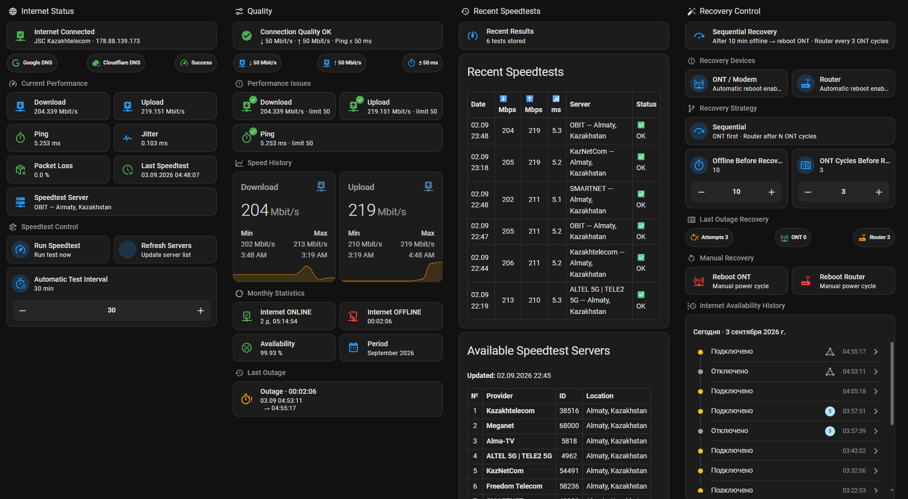

# DigitalHouses Speedtest

Home Assistant App for internet availability monitoring and scheduled speed tests using the official Ookla Speedtest CLI.



## English

### Features

- Download and upload speed
- Ping and jitter
- Packet loss when returned by Ookla
- ISP, public IP, selected server, server ID and result URL
- Manual speed-test button
- Periodic tests every 5–720 minutes
- Live periodic-interval Number with immediate rescheduling
- Independent connectivity checks to `8.8.8.8` and `1.1.1.1`
- Preferred Ookla server IDs with automatic fallback
- Nearby-server discovery
- MQTT Numbers for performance thresholds
- Problem binary sensors with immediate recalculation
- Persistent Recent results for successful tests
- Home Assistant MQTT Device Discovery
- Persistent state in `/data`

### Requirements

- Home Assistant OS or supervised Home Assistant with Apps support
- MQTT broker exposed through Home Assistant Supervisor
- `amd64` architecture

### Installation

1. Open **Settings → Apps → App store**.
2. Open the menu and select **Repositories**.
3. Add:

   ```text
   https://github.com/DigitalHouses/home-assistant-apps
   ```

4. Install **DigitalHouses Speedtest**.
5. Review the configuration and start the App.
6. Enable **Start on boot** and **Watchdog** after the first successful run.

### Configuration example

```yaml
periodic_test_enabled: true
periodic_test_interval_minutes: 30
server_ids: []
automatic_server_fallback: true
speedtest_timeout_seconds: 240

connectivity_check:
  interval_seconds: 60
  attempts: 3
  timeout_seconds: 2

expire_after_seconds: 14400
recent_results_limit: 20
log_level: info
```

`recent_results_limit` accepts values from 5 to 50. Only successful tests are stored.

### Periodic test interval

The App exposes:

```text
number.internet_speed_periodic_interval
```

The Number accepts 5–720 minutes with a 5-minute UI step.

Changing it in Home Assistant immediately restarts the countdown to the next automatic test. The App does not need to restart.

The `periodic_test_interval_minutes` App option remains supported for backward compatibility. `periodic_test_enabled` remains the master enable/disable option.

### Performance thresholds

The App exposes three threshold Numbers:

```text
number.internet_speed_minimum_download
number.internet_speed_minimum_upload
number.internet_speed_maximum_ping
```

Default values:

- Minimum download: `10 Mbit/s`
- Minimum upload: `10 Mbit/s`
- Maximum ping: `200 ms`

The values can be changed directly in Home Assistant without restarting the App.

Strict comparison rules:

```text
Low download speed = ON when download < minimum download
Low upload speed   = ON when upload < minimum upload
High ping          = ON when ping > maximum ping
```

Equality is normal and produces `OFF`.

The aggregate sensor:

```text
binary_sensor.internet_speed_performance_problem
```

is `ON` when any of the three performance problems is active.

### Freshness and failures

A failed test or missing connectivity:

- does not overwrite the last successful measurements;
- does not add a Recent result;
- does not create a false speed problem.

The previous successful measurement remains valid until `expire_after_seconds`.

After expiration, measurement and performance problem entities become `unavailable` until the next successful test.

### Recent results

```text
sensor.internet_speed_recent_results
```

stores the newest successful tests persistently in:

```text
/data/recent_results.json
```

Its state is the number of stored entries.

Attributes include:

- `updated_at`
- `count`
- `limit`
- `results`

Each result contains measured values, selected server, result URL, the thresholds active at test time and ready-to-use problem flags.

Changing thresholds later recalculates current problem sensors but does not rewrite historical results.

### Server selection

Leave `server_ids` empty for automatic Ookla server selection:

```yaml
server_ids: []
```

To use preferred servers, list IDs in priority order:

```yaml
server_ids:
  - 38516
  - 70668
```

Use **Refresh server list** and inspect:

```text
sensor.internet_speed_available_servers
```

### Home Assistant entities

The App creates one MQTT device named **Internet Speedtest**.

#### Measurements

```text
sensor.internet_speed_download
sensor.internet_speed_upload
sensor.internet_speed_ping
sensor.internet_speed_jitter
sensor.internet_speed_packet_loss
```

#### Test information

```text
sensor.internet_speed_status
sensor.internet_speed_last_test
sensor.internet_speed_provider
sensor.internet_speed_external_ip
sensor.internet_speed_server
sensor.internet_speed_server_id
sensor.internet_speed_result_url
```

#### Connectivity

```text
binary_sensor.internet_google_dns_connectivity
binary_sensor.internet_cloudflare_dns_connectivity
```

#### Performance thresholds

```text
number.internet_speed_minimum_download
number.internet_speed_minimum_upload
number.internet_speed_maximum_ping
number.internet_speed_periodic_interval
```

#### Performance problems

```text
binary_sensor.internet_speed_low_download
binary_sensor.internet_speed_low_upload
binary_sensor.internet_speed_high_ping
binary_sensor.internet_speed_performance_problem
```

#### History and server discovery

```text
sensor.internet_speed_recent_results
sensor.internet_speed_available_servers
sensor.internet_speed_server_list_updated
```

#### Actions

```text
button.internet_speed_run
button.internet_speed_refresh_servers
```

### Dashboard

The screenshot at the top shows the recommended monitoring dashboard.

It combines:

- current internet and DNS state;
- download, upload, ping, jitter and packet loss;
- configurable quality thresholds;
- download/upload history graphs;
- recent Speedtest results;
- available Ookla servers;
- monthly internet availability statistics;
- ONT/router recovery controls and internet availability history.

The repository ships one canonical dashboard:

```text
examples/lovelace/internet_speedtest_dashboard.yaml
```

The previous basic dashboard has been replaced by the current featured layout.

UI requirements:

- [Mushroom](https://github.com/piitaya/lovelace-mushroom)
- [mini-graph-card](https://github.com/kalkih/mini-graph-card)
- built-in Home Assistant Markdown and Logbook cards

The Speedtest measurement, quality, history and server sections use entities published by this App. The recovery, monthly availability and outage-history sections shown in the screenshot are part of the wider DigitalHouses internet-monitoring stack and require the corresponding companion Home Assistant package/entities.

### Recorder package

A Recorder package is provided at:

```text
examples/packages/internet_speedtest_package.yaml
```

Copy it to:

```text
/config/packages/internet_speedtest_package.yaml
```

The Recorder package should include measurements, connectivity sensors, thresholds, the periodic interval, performance problem sensors, server information and action entities.

`sensor.internet_speed_recent_results` is intentionally excluded because its large `results` attribute would duplicate persistent App history and unnecessarily increase the Home Assistant Recorder database.

### Troubleshooting

#### Packet loss is `unknown`

Some Ookla servers do not return packet-loss data.

`unknown` means that the server did not provide a value. It does not mean `0%`.

#### Performance sensors are unavailable

No successful test exists yet, or the last successful result is older than `expire_after_seconds`.

Run a new test.

#### A threshold changed but history did not

This is intentional.

Current problem sensors are recalculated immediately, while historical Recent results retain the thresholds that were active when each test was performed.

### Feedback

- Questions and experience: use **GitHub Discussions**
- Confirmed bugs and feature requests: use **GitHub Issues**

Do not publish passwords, MQTT credentials, access tokens, external IP addresses or unique Ookla result URLs.

### License

DigitalHouses source code is licensed under the MIT License.

This App downloads and runs the official proprietary Ookla Speedtest CLI. Users are responsible for reviewing and complying with Ookla's license, terms of use and privacy policy.

---

## Русский

### Возможности

- Скорость скачивания и отдачи
- Ping и jitter
- Packet loss, если показатель возвращён Ookla
- Провайдер, внешний IP, выбранный сервер, ID сервера и URL результата
- Ручной запуск Speedtest
- Периодические тесты с интервалом 5–720 минут
- Изменение интервала через Number без перезапуска App
- Независимые проверки `8.8.8.8` и `1.1.1.1`
- Приоритетные Ookla server ID и автоматический fallback
- Получение списка ближайших серверов
- Настраиваемые пороги качества прямо из Home Assistant
- Problem binary sensors с немедленным пересчётом
- Постоянная история последних успешных тестов
- Home Assistant MQTT Device Discovery
- Хранение состояния в `/data`

### Требования

- Home Assistant OS или supervised Home Assistant с поддержкой Apps
- MQTT broker, предоставленный через Home Assistant Supervisor
- Архитектура `amd64`

### Установка

1. Откройте **Настройки → Дополнения → Магазин дополнений**.
2. Откройте меню **Репозитории**.
3. Добавьте:

   ```text
   https://github.com/DigitalHouses/home-assistant-apps
   ```

4. Установите **DigitalHouses Speedtest**.
5. Проверьте конфигурацию и запустите App.
6. После первого успешного запуска включите **Автозапуск** и **Watchdog**.

### Пример конфигурации

```yaml
periodic_test_enabled: true
periodic_test_interval_minutes: 30
server_ids: []
automatic_server_fallback: true
speedtest_timeout_seconds: 240

connectivity_check:
  interval_seconds: 60
  attempts: 3
  timeout_seconds: 2

expire_after_seconds: 14400
recent_results_limit: 20
log_level: info
```

`recent_results_limit` принимает значения от 5 до 50. В историю записываются только успешные тесты.

### Интервал периодических тестов

App создаёт:

```text
number.internet_speed_periodic_interval
```

Диапазон — 5–720 минут, шаг интерфейса — 5 минут.

Изменение значения в Home Assistant сразу перезапускает отсчёт до следующего автоматического теста. Перезапуск App не требуется.

`periodic_test_interval_minutes` сохранён для обратной совместимости, а `periodic_test_enabled` остаётся главным выключателем автоматических тестов.

### Пороги качества

App создаёт:

```text
number.internet_speed_minimum_download
number.internet_speed_minimum_upload
number.internet_speed_maximum_ping
```

Значения по умолчанию:

- минимальный Download — `10 Mbit/s`;
- минимальный Upload — `10 Mbit/s`;
- максимальный Ping — `200 ms`.

Логика:

```text
Low download speed = ON, если download < minimum download
Low upload speed   = ON, если upload < minimum upload
High ping          = ON, если ping > maximum ping
```

Равенство считается нормой.

Общий сенсор:

```text
binary_sensor.internet_speed_performance_problem
```

включается при наличии хотя бы одной из трёх проблем.

### Ошибки и устаревание данных

Ошибка Speedtest или отсутствие connectivity:

- не заменяет последние успешные измерения;
- не создаёт Recent result;
- не считается автоматически плохой скоростью.

Последний успешный результат действует до `expire_after_seconds`.

После истечения этого времени измерительные и problem entities становятся `unavailable` до следующего успешного теста.

### Recent results

```text
sensor.internet_speed_recent_results
```

постоянно хранит последние успешные тесты в:

```text
/data/recent_results.json
```

Состояние сенсора — количество записей.

Атрибуты:

- `updated_at`
- `count`
- `limit`
- `results`

Историческая запись сохраняет измерения, сервер, URL результата, действовавшие в момент теста пороги и problem flags.

Изменение порогов пересчитывает текущие problem sensors, но не переписывает историю.

### Выбор сервера

Для автоматического выбора:

```yaml
server_ids: []
```

Для приоритетных серверов:

```yaml
server_ids:
  - 38516
  - 70668
```

Кнопка **Refresh server list** обновляет:

```text
sensor.internet_speed_available_servers
```

### Панель Home Assistant

Скриншот в начале README показывает рекомендуемую панель мониторинга.

На ней собраны:

- текущее состояние интернета и DNS;
- Download, Upload, Ping, Jitter и Packet Loss;
- пороги качества;
- графики Download/Upload;
- последние результаты Speedtest;
- список доступных серверов Ookla;
- месячная статистика доступности;
- управление восстановлением через ONT/Router;
- история доступности интернета.

В репозитории остаётся один актуальный dashboard:

```text
examples/lovelace/internet_speedtest_dashboard.yaml
```

Старый базовый dashboard заменён текущим вариантом.

Для интерфейса нужны:

- [Mushroom](https://github.com/piitaya/lovelace-mushroom)
- [mini-graph-card](https://github.com/kalkih/mini-graph-card)
- встроенные Markdown и Logbook карточки Home Assistant

Разделы Speedtest, качества, истории тестов и серверов используют сущности этого App. Показанные на скриншоте Recovery, месячная статистика доступности и история отключений относятся к расширенному стеку DigitalHouses и требуют соответствующего companion-пакета/сущностей Home Assistant.

### Recorder

Пакет находится здесь:

```text
examples/packages/internet_speedtest_package.yaml
```

Его можно скопировать в:

```text
/config/packages/internet_speedtest_package.yaml
```

В Recorder нужно включить измерения, connectivity sensors, пороги, периодический интервал, problem sensors и диагностические сущности.

`sensor.internet_speed_recent_results` намеренно не записывается в Recorder, потому что большой массив `results` дублирует постоянную историю App и будет лишний раз увеличивать базу Home Assistant.

### Обратная связь

- вопросы и опыт — **GitHub Discussions**;
- подтверждённые ошибки и запросы функций — **GitHub Issues**.

Не публикуйте пароли, MQTT credentials, access tokens, внешний IP и уникальные Ookla result URLs.

### Лицензия

Исходный код DigitalHouses распространяется по MIT License.

Приложение загружает и запускает официальный проприетарный Ookla Speedtest CLI. Пользователь самостоятельно отвечает за соблюдение лицензии, условий использования и политики конфиденциальности Ookla.
